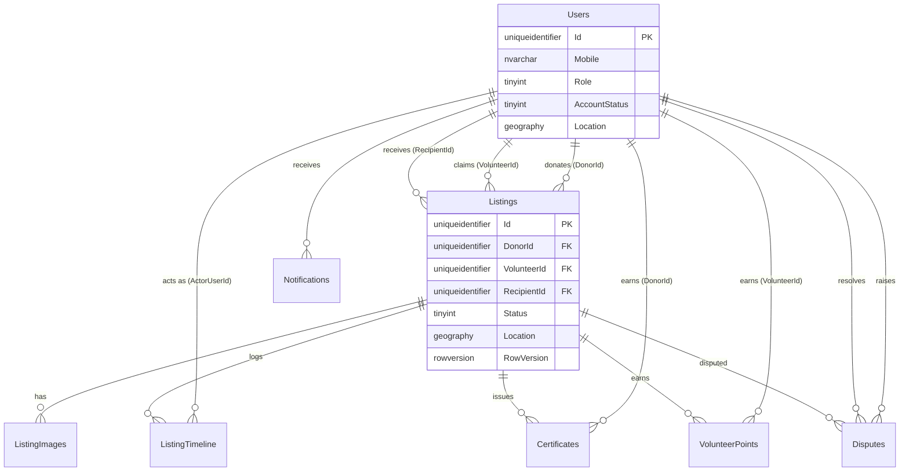

# FoodBridge — Architecture

> Filled in progressively as phases land. See `docs/PLAN.md` for phase status.

## Solution structure

## Layer responsibilities & dependency rule

## SOLID in practice

## Listing lifecycle (state machine)

## Data dictionary

All tables use `Id uniqueidentifier` primary keys defaulted to `NEWSEQUENTIALID()` unless noted. `CreatedAtUtc`/`UpdatedAtUtc` are `datetime2`, always UTC.

### Users
| Column | Type | Notes |
|---|---|---|
| Id | uniqueidentifier PK | |
| Mobile | nvarchar(15) | unique |
| Name | nvarchar(200) | |
| Role | tinyint | see enum table |
| City | nvarchar(100) | nullable |
| Address | nvarchar(500) | nullable |
| Latitude / Longitude | decimal(9,6) | nullable |
| Location | geography | nullable; spatial index `SIX_Users_Location` |
| RecipientType | tinyint | nullable; recipients only — see enum table. Added post-Phase-1 in `M202607230900_AddRecipientTypeToUsers` |
| CapacityMeals | int | nullable; recipients only |
| IsAvailable | bit | default 1 |
| AccountStatus | tinyint | see enum table |
| AvatarUrl | nvarchar(500) | nullable |
| IsDeleted | bit | soft delete |

### OtpCodes
| Column | Type | Notes |
|---|---|---|
| Id | uniqueidentifier PK | |
| Mobile | nvarchar(15) | |
| CodeHash | nvarchar(256) | never plaintext |
| ExpiresAtUtc | datetime2 | |
| Attempts | int | default 0 |
| ConsumedAtUtc | datetime2 | nullable |

### Listings
| Column | Type | Notes |
|---|---|---|
| Id | uniqueidentifier PK | |
| DonorId | uniqueidentifier FK → Users | |
| Title | nvarchar(200) | |
| FoodType | nvarchar(100) | |
| QuantityMeals | int | |
| FreshnessTag | tinyint | see enum table |
| PreparedAtUtc | datetime2 | nullable |
| PickupDeadlineUtc | datetime2 | |
| PickupAddress | nvarchar(500) | |
| Latitude / Longitude | decimal(9,6) | |
| Location | geography | spatial index `SIX_Listings_Location` |
| Status | tinyint | see enum table; index `IX_Listings_Status_PickupDeadlineUtc` |
| VolunteerId | uniqueidentifier FK → Users | nullable |
| RecipientId | uniqueidentifier FK → Users | nullable |
| RowVersion | rowversion | optimistic concurrency for claim |
| IsDeleted | bit | soft delete |

### ListingImages
| Column | Type | Notes |
|---|---|---|
| Id | uniqueidentifier PK | |
| ListingId | uniqueidentifier FK → Listings | |
| ImageUrl | nvarchar(500) | |

### ListingTimeline
Append-only event log — no `UpdatedAtUtc` (rows are never modified).
| Column | Type | Notes |
|---|---|---|
| Id | uniqueidentifier PK | |
| ListingId | uniqueidentifier FK → Listings | |
| FromStatus | tinyint | nullable (null on creation) |
| ToStatus | tinyint | |
| ActorUserId | uniqueidentifier FK → Users | |
| Note | nvarchar(1000) | nullable |
| PhotoUrl | nvarchar(500) | nullable |
| CreatedAtUtc | datetime2 | |

### Notifications
| Column | Type | Notes |
|---|---|---|
| Id | uniqueidentifier PK | |
| UserId | uniqueidentifier FK → Users | index `IX_Notifications_UserId_IsRead` |
| Type | nvarchar(50) | free-form category, e.g. `ListingClaimed` |
| Title | nvarchar(200) | |
| Body | nvarchar(1000) | |
| PayloadJson | nvarchar(MAX) | nullable |
| IsRead | bit | default 0 |

### Certificates
| Column | Type | Notes |
|---|---|---|
| Id | uniqueidentifier PK | |
| CertificateNumber | nvarchar(30) | unique; format `FB-{yyyyMM}-{seq:D5}` |
| DonorId | uniqueidentifier FK → Users | |
| ListingId | uniqueidentifier FK → Listings | |
| MealsCount | int | |
| IssuedAtUtc | datetime2 | |
| PdfUrl | nvarchar(500) | nullable until first render |

### VolunteerPoints
Insert-only ledger; leaderboard = `SUM(Points) GROUP BY VolunteerId`.
| Column | Type | Notes |
|---|---|---|
| Id | uniqueidentifier PK | |
| VolunteerId | uniqueidentifier FK → Users | |
| ListingId | uniqueidentifier FK → Listings | |
| Points | int | |
| Reason | nvarchar(200) | |

### Disputes
| Column | Type | Notes |
|---|---|---|
| Id | uniqueidentifier PK | |
| ListingId | uniqueidentifier FK → Listings | |
| RaisedByUserId | uniqueidentifier FK → Users | |
| Reason | nvarchar(1000) | |
| Status | tinyint | see enum table |
| ResolvedByUserId | uniqueidentifier FK → Users | nullable |
| ResolutionNote | nvarchar(1000) | nullable |

### Enum value tables

**Users.Role**
| Value | Name |
|---|---|
| 1 | Donor |
| 2 | Volunteer |
| 3 | Recipient |
| 4 | Admin |

**Users.AccountStatus**
| Value | Name |
|---|---|
| 1 | Pending |
| 2 | Verified |
| 3 | Suspended |

**Users.RecipientType** (nullable; recipients only)
| Value | Name |
|---|---|
| 1 | Individual |
| 2 | Organization |

**Listings.FreshnessTag**
| Value | Name |
|---|---|
| 1 | JustCooked |
| 2 | FewHoursOld |
| 3 | Packaged |

**Listings.Status**
| Value | Name |
|---|---|
| 1 | Pending |
| 2 | Claimed |
| 3 | PickedUp |
| 4 | Delivered |
| 5 | Confirmed |
| 6 | Expired |
| 7 | Cancelled |
| 8 | Rejected |

**Disputes.Status**
| Value | Name |
|---|---|
| 1 | Open |
| 2 | Resolved |

### Entity relationship diagram

### Seed data
Development-only (`[Profile("Development")]`), demo city: Ahmedabad, Gujarat. 1 admin, 2 donors, 3 volunteers, 2 pre-verified recipients, 8 listings spanning Pending/Claimed/PickedUp/Delivered/Confirmed/Expired.

## Sequence diagram — happy path

## Decisions & tradeoffs log

- **FluentMigrator `[Profile("Development")]` re-runs unconditionally.** Profile-tagged migrations execute once via the normal version-tracked sequence *and* again via `ApplyProfiles()` on every `MigrateUp()` call — by design, meant for idempotent reference-data refreshes. The seed migration (`M202607221010_SeedDevelopmentData`) guards its `Up()` with an `IF EXISTS ... RETURN` check on a sentinel row so re-running it (or starting the app repeatedly) never throws a duplicate-key error.
- **`TrustServerCertificate=True` required for the LAN SQL Express instance.** `Microsoft.Data.SqlClient` defaults to `Encrypt=Mandatory`; without trusting the server's self-signed cert, the TLS handshake fails before login is even attempted. Fine for local/dev; a real cert (or `Encrypt=false` only on a trusted network) should replace this before any non-dev deployment.
- **Middleware order: `RequestLoggingMiddleware` must wrap `ExceptionHandlingMiddleware`, not the other way round.** If the exception handler is outermost, the logging middleware's `finally` block observes the response mid-unwind — before the handler has set the final status code — and logs the pre-exception status (e.g. `200`) instead of the real one (`500`).
- **`RateLimitExceededException` (429) added alongside `BusinessRuleException` (422).** Phase 2's spec calls for send-otp's rate limit to return 429 while verify-otp's attempt limit returns 422 — two different "expected failure" shapes. Rather than overload `BusinessRuleException`, a distinct exception+mapping keeps the 429 case explicit; the 422 cases go through `Result.Failure` instead of an exception at all (per the "services don't throw for expected failures" rule) since `BaseController.HandleResult` only ever produces 200/422.
- **`JwtBearerOptions.MapInboundClaims = false` is required.** `System.IdentityModel.Tokens.Jwt`'s default inbound claim mapping silently rewrites short claim names like `sub` to the legacy long-form `ClaimTypes.NameIdentifier` URI on the server side after validation — so a token issued with a `sub` claim reads back as null via `User.FindFirstValue("sub")` unless this is set. Caught via `/api/auth/me` returning 500 instead of 401/200.
- **Registration is a two-step OTP → session-token → register flow, not a DB-backed session table.** `verify-otp` for a not-yet-existing mobile returns a short-lived (10 min) signed token (`PasswordlessSessionHelper`, same JWT mechanics as real auth tokens but carrying only a `mobile` + `purpose=registration` claim, no `sub`). `register` validates that token instead of re-verifying the OTP, keeping the OTP single-use while avoiding a stateful session store.
- **`dailyRequirement` (mentioned in the original registration spec for recipients) is not persisted.** The Phase 1 `Users` schema only has `CapacityMeals` — no column exists for it, and adding one wasn't asked for, so `RegisterRequest` omits it.
- **Prototype comparison (`docs/FoodBridge_Bootstrap_Prototype 1.html`) drove three schema/scope decisions**, made after comparing its UI flows against the Phase 1–2 implementation and the remaining phase plan:
  1. **`Users.RecipientType`** (Individual/Organization) added via `M202607230900_AddRecipientTypeToUsers`, wired into `RegisterRequest`/`AuthService`/`UserResponse` immediately since it's a Phase 2 (registration) concern. The prototype distinguishes household recipients from NGO/org recipients with different meaning for their capacity field (household size vs. daily serving capacity) — `CapacityMeals` stays a single int either way; only the label/interpretation differs by `RecipientType`.
  2. **Listings will get `DietType` (Veg/Non-Veg) and `MealType` (Breakfast/Lunch/Dinner/Snacks) columns in Phase 4**, on top of the freeform `FoodType` text column from Phase 1. The prototype tracks these as two distinct structured fields, enabling future filtering by diet/meal-slot that a single text field can't support. *Not yet implemented — deferred to Phase 4 start, since `Listings` service/repository code doesn't exist yet.*
  3. **Phase 6's recipient-reject will implement simple auto-reassignment** (immediately reassign to the nearest other available Verified recipient via `RecipientMatcher`), a scope increase from the original "volunteer manually re-picks, full auto-reassignment is roadmap-only" note — the prototype demos live auto-reassignment on reject. *Not yet implemented — deferred to Phase 6 start.*
  - Other prototype behaviors were reviewed and intentionally left unchanged: hard-delete-on-cancel (prototype has no real backend, soft-cancel + audit trail is correct for a real one), recipient-accept not changing listing status (matches the original Phase 6 spec exactly), and all photo/GPS/map features being cosmetic-only (the real `IFileStorage` + geography-column design already exceeds the mock).
- **`wwwroot/uploads` must exist *before* `WebApplication.CreateBuilder(args)` runs, not just before `UseStaticFiles()`.** `IWebHostEnvironment.WebRootFileProvider` is snapshotted during builder construction; if `wwwroot` is missing at that instant, it's locked in as a `NullFileProvider` for the app's lifetime — creating the directory afterward (even before `UseStaticFiles()`) doesn't fix it. `Program.cs` now creates the uploads directory as the very first statement, before the builder is created. Caught because the avatar-upload endpoint returned a URL that 404'd.
- **Authorization for "self or admin" / "self only" / role-restricted actions lives in the service layer (`UserService`), not `[Authorize(Policy=...)]` attributes.** Policies answer "what role is the caller," not "does the caller own this specific resource," so per-resource checks use the injected `ICurrentUser` inside the service and throw `UnauthorizedAccessException` (→ 403) — consistent with controllers staying thin translators.

## Roadmap
