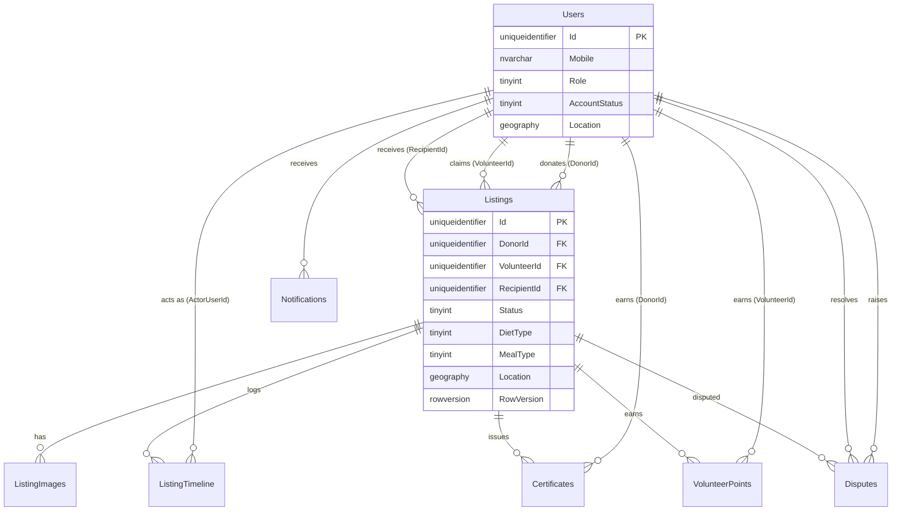

# FoodBridge — Architecture

> Filled in progressively as phases land. See `docs/PLAN.md` for phase status.

## Solution structure

## Layer responsibilities & dependency rule

## SOLID in practice

## Listing lifecycle (state machine)

Single source of truth: `FoodBridge.Domain.StateMachines.ListingStateMachine`. Any transition not listed throws `BusinessRuleException` → 422.

```
Pending  → Claimed (volunteer claim)     | Cancelled (donor) | Expired (job)
Claimed  → PickedUp (volunteer + photo)  | Pending (volunteer un-claims — optional)
PickedUp → Delivered (volunteer + photo)
Delivered→ Confirmed (recipient)         → points + certificate + notifications
```

Recipient-reject (Phase 6) clears `RecipientId`/re-assigns without changing `Status` away from `PickedUp` — it is deliberately *not* modeled as a transition in `ListingStateMachine`, since the status itself doesn't change.

Phase 4 also enforces a related-but-distinct rule directly in `ListingService` (not via the state machine, since it isn't a transition): a listing can only be edited (`PUT`) or have images added while `Status == Pending`; both throw `BusinessRuleException` → 422 otherwise.

Phase 5 (`VolunteerListingService`) drives the `Pending → Claimed`, `Claimed → PickedUp`, and `PickedUp → Delivered` transitions:
- **Claim is deliberately *not* routed through `ListingStateMachine`.** A concurrent claim race is a conflict-with-current-state (409), not an invalid-transition-attempt (422) — see the dedicated decision-log entry below. `confirm-pickup`/`confirm-delivery` *do* go through `ListingStateMachine.EnsureCanTransition` (→ 422 on a wrong status), matching the phase's "invalid transitions blocked by ListingStateMachine" acceptance criterion.
- `confirm-pickup` auto-assigns `RecipientId` via `RecipientMatcher` if not already set (nearest available Verified recipient by geography distance); if none is available the pickup still succeeds (status still advances) but `RecipientId` stays null.
- `confirm-delivery` additionally requires `RecipientId` to be set — `BusinessRuleException` (422) otherwise, since delivering to nobody isn't meaningful.

Phase 6 (`RecipientListingService`) covers `accept`/`reject` (both same-status, `PickedUp → PickedUp`, gated by `EnsureAwaitingDecision` rather than `ListingStateMachine` — see above) and drives the final `Delivered → Confirmed` transition via `confirm-receipt`:
- **`accept` is purely a timeline entry.** It doesn't change `Status`, `RecipientId`, or anything else — it just records that the matched recipient has acknowledged the incoming delivery. Matches the earlier prototype-comparison decision ("recipient-accept not changing listing status").
- **`reject` re-matches via `RecipientMatcher`, excluding every recipient who has already rejected *this* listing, not just the current one.** See the dedicated decision-log entry below — excluding only the current recipient causes two recipients to ping-pong forever instead of ever reaching "no recipient available".
- **`confirm-receipt` is the one operation that fans out beyond `Listings`/`ListingTimeline`.** In one transaction (`IListingRepository.ConfirmReceiptAsync`): `Listings.Status → Confirmed`, a `ListingTimeline` row, a `VolunteerPoints` row, a `Certificates` row (with a generated `CertificateNumber`, `PdfUrl` left null until Phase 8 renders it), and one `Notifications` row each for the donor and the volunteer. All five writes share one `IDbTransaction` — see the atomicity decision-log entry below.

## Data dictionary

All tables use `Id uniqueidentifier` primary keys defaulted to `NEWSEQUENTIALID()` unless noted. `CreatedAtUtc`/`UpdatedAtUtc` are `datetime2`, always UTC.

### Users
| Column | Type | Notes |
|---|---|---|
| Id | uniqueidentifier PK | |
| Mobile | nvarchar(15) | unique |
| Name | nvarchar(200) | |
| Role | tinyint | see enum table |
| City | nvarchar(100) | nullable |
| Address | nvarchar(500) | nullable |
| Latitude / Longitude | decimal(9,6) | nullable |
| Location | geography | nullable; spatial index `SIX_Users_Location` |
| RecipientType | tinyint | nullable; recipients only — see enum table. Added post-Phase-1 in `M202607230900_AddRecipientTypeToUsers` |
| CapacityMeals | int | nullable; recipients only |
| IsAvailable | bit | default 1 |
| AccountStatus | tinyint | see enum table |
| AvatarUrl | nvarchar(500) | nullable |
| IsDeleted | bit | soft delete |

### OtpCodes
| Column | Type | Notes |
|---|---|---|
| Id | uniqueidentifier PK | |
| Mobile | nvarchar(15) | |
| CodeHash | nvarchar(256) | never plaintext |
| ExpiresAtUtc | datetime2 | |
| Attempts | int | default 0 |
| ConsumedAtUtc | datetime2 | nullable |

### Listings
| Column | Type | Notes |
|---|---|---|
| Id | uniqueidentifier PK | |
| DonorId | uniqueidentifier FK → Users | |
| Title | nvarchar(200) | |
| FoodType | nvarchar(100) | freeform |
| DietType | tinyint | nullable; see enum table. Added in `M202607231100_AddDietTypeAndMealTypeToListings` |
| MealType | tinyint | nullable; see enum table. Added in `M202607231100_AddDietTypeAndMealTypeToListings` |
| QuantityMeals | int | |
| FreshnessTag | tinyint | see enum table |
| PreparedAtUtc | datetime2 | nullable |
| PickupDeadlineUtc | datetime2 | |
| PickupAddress | nvarchar(500) | |
| Latitude / Longitude | decimal(9,6) | |
| Location | geography | spatial index `SIX_Listings_Location` |
| Status | tinyint | see enum table; index `IX_Listings_Status_PickupDeadlineUtc` |
| VolunteerId | uniqueidentifier FK → Users | nullable |
| RecipientId | uniqueidentifier FK → Users | nullable |
| RowVersion | rowversion | optimistic concurrency for claim |
| IsDeleted | bit | soft delete |

### ListingImages
| Column | Type | Notes |
|---|---|---|
| Id | uniqueidentifier PK | |
| ListingId | uniqueidentifier FK → Listings | |
| ImageUrl | nvarchar(500) | |

### ListingTimeline
Append-only event log — no `UpdatedAtUtc` (rows are never modified).
| Column | Type | Notes |
|---|---|---|
| Id | uniqueidentifier PK | |
| ListingId | uniqueidentifier FK → Listings | |
| FromStatus | tinyint | nullable (null on creation) |
| ToStatus | tinyint | |
| ActorUserId | uniqueidentifier FK → Users | nullable — null for system-initiated events (e.g. automatic expiry). Made nullable in Phase 7 via `M202607241200_MakeListingTimelineActorNullable` |
| Note | nvarchar(1000) | nullable |
| PhotoUrl | nvarchar(500) | nullable |
| CreatedAtUtc | datetime2 | |

### Notifications
| Column | Type | Notes |
|---|---|---|
| Id | uniqueidentifier PK | |
| UserId | uniqueidentifier FK → Users | index `IX_Notifications_UserId_IsRead` |
| Type | nvarchar(50) | free-form category, e.g. `ListingClaimed` |
| Title | nvarchar(200) | |
| Body | nvarchar(1000) | |
| PayloadJson | nvarchar(MAX) | nullable |
| IsRead | bit | default 0 |

### Certificates
| Column | Type | Notes |
|---|---|---|
| Id | uniqueidentifier PK | |
| CertificateNumber | nvarchar(30) | unique; format `FB-{yyyyMM}-{seq:D5}` |
| DonorId | uniqueidentifier FK → Users | |
| ListingId | uniqueidentifier FK → Listings | |
| MealsCount | int | |
| IssuedAtUtc | datetime2 | |
| PdfUrl | nvarchar(500) | nullable until first render |

### VolunteerPoints
Insert-only ledger; leaderboard = `SUM(Points) GROUP BY VolunteerId`.
| Column | Type | Notes |
|---|---|---|
| Id | uniqueidentifier PK | |
| VolunteerId | uniqueidentifier FK → Users | |
| ListingId | uniqueidentifier FK → Listings | |
| Points | int | |
| Reason | nvarchar(200) | |

### Disputes
| Column | Type | Notes |
|---|---|---|
| Id | uniqueidentifier PK | |
| ListingId | uniqueidentifier FK → Listings | |
| RaisedByUserId | uniqueidentifier FK → Users | |
| Reason | nvarchar(1000) | |
| Status | tinyint | see enum table |
| ResolvedByUserId | uniqueidentifier FK → Users | nullable |
| ResolutionNote | nvarchar(1000) | nullable |

### Enum value tables

**Users.Role**
| Value | Name |
|---|---|
| 1 | Donor |
| 2 | Volunteer |
| 3 | Recipient |
| 4 | Admin |

**Users.AccountStatus**
| Value | Name |
|---|---|
| 1 | Pending |
| 2 | Verified |
| 3 | Suspended |

**Users.RecipientType** (nullable; recipients only)
| Value | Name |
|---|---|
| 1 | Individual |
| 2 | Organization |

**Listings.FreshnessTag**
| Value | Name |
|---|---|
| 1 | JustCooked |
| 2 | FewHoursOld |
| 3 | Packaged |

**Listings.DietType** (nullable)
| Value | Name |
|---|---|
| 1 | Veg |
| 2 | NonVeg |

**Listings.MealType** (nullable)
| Value | Name |
|---|---|
| 1 | Breakfast |
| 2 | Lunch |
| 3 | Dinner |
| 4 | Snacks |

**Listings.Status**
| Value | Name |
|---|---|
| 1 | Pending |
| 2 | Claimed |
| 3 | PickedUp |
| 4 | Delivered |
| 5 | Confirmed |
| 6 | Expired |
| 7 | Cancelled |
| 8 | Rejected |

**Disputes.Status**
| Value | Name |
|---|---|
| 1 | Open |
| 2 | Resolved |

### Entity relationship diagram



### Seed data
Development-only (`[Profile("Development")]`), demo city: Ahmedabad, Gujarat. 1 admin, 2 donors, 3 volunteers, 2 pre-verified recipients, 8 listings spanning Pending/Claimed/PickedUp/Delivered/Confirmed/Expired.

**Dev login shortcut**: with `appsettings.Development.json`'s `Otp:FixedDevelopmentCode` set (default `123456`), every `send-otp` issues that fixed code instead of a random one — skip checking the console/log, just call `verify-otp` with `123456` directly. Seeded mobiles, one per role:

| Mobile | Name | Role | Notes |
|---|---|---|---|
| 9999900000 | FoodBridge Admin | Admin | |
| 9999900001 | Green Leaf Restaurant | Donor | |
| 9999900002 | Sunrise Caterers | Donor | |
| 9999900003 | Raj Patel | Volunteer | |
| 9999900004 | Priya Shah | Volunteer | |
| 9999900005 | Aman Verma | Volunteer | |
| 9999900006 | Hope NGO | Recipient | pre-`Verified`, capacity 200 |
| 9999900007 | Asha Foundation | Recipient | pre-`Verified`, capacity 150 |

## Sequence diagram — happy path

## Real-time (SignalR) contract

Both hubs require a JWT — the standard `Authorization: Bearer` header for plain requests, or an `access_token` query-string parameter for the hub connection itself, since WebSocket/SSE transports can't set custom headers during the handshake. `Program.cs`'s `JwtBearerEvents.OnMessageReceived` only honors that query-string fallback for paths under `/hubs`; everywhere else it's ignored.

### `/hubs/notifications` (`NotificationsHub`)
- On connect, the server adds the connection to a per-user group (`user:{userId}`, derived from the `sub` claim) — no client action needed.
- **Server → client event**: `ReceiveNotification(NotificationResponse)` — pushed by `SignalRNotificationDispatcher` immediately after a notification is persisted (currently only from `confirm-receipt`). Best-effort: if the user has no open connection, they only see it via `GET /api/notifications`.
- No client-invokable methods.

### `/hubs/tracking` (`TrackingHub`)
- **Client → server**: `JoinTracking(listingId)` / `LeaveTracking(listingId)` — join/leave the `listing:{listingId}` group. `JoinTracking` re-validates the caller is the listing's donor, assigned volunteer, or matched recipient (via `ITrackingService.GetTrackingAsync`'s ownership check) and throws `HubException` otherwise.
- **Client → server**: `UpdateLocation(listingId, latitude, longitude)` — assigned-volunteer only (`HubException` otherwise); stores the reading in `ITrackingStore` and broadcasts it.
- **Server → client event**: `LocationUpdated(TrackingResponse)` — broadcast to the `listing:{listingId}` group whenever `UpdateLocation` succeeds.
- **REST fallback**: `GET /api/listings/{id}/track` returns the same last-known reading (or null) for clients that aren't connected.

Verified live with a real two-connection `Microsoft.AspNetCore.SignalR.Client` harness (not just code review): both hubs authenticate correctly over the query-string token, `ReceiveNotification` reaches only the intended user's connection (donor and volunteer each got *only* their own notification out of the same `confirm-receipt` call), and `LocationUpdated` reaches a donor who joined a listing's tracking group after the assigned volunteer reported a position.

## Decisions & tradeoffs log

- **FluentMigrator `[Profile("Development")]` re-runs unconditionally.** Profile-tagged migrations execute once via the normal version-tracked sequence *and* again via `ApplyProfiles()` on every `MigrateUp()` call — by design, meant for idempotent reference-data refreshes. The seed migration (`M202607221010_SeedDevelopmentData`) guards its `Up()` with an `IF EXISTS ... RETURN` check on a sentinel row so re-running it (or starting the app repeatedly) never throws a duplicate-key error.
- **`TrustServerCertificate=True` required for the LAN SQL Express instance.** `Microsoft.Data.SqlClient` defaults to `Encrypt=Mandatory`; without trusting the server's self-signed cert, the TLS handshake fails before login is even attempted. Fine for local/dev; a real cert (or `Encrypt=false` only on a trusted network) should replace this before any non-dev deployment.
- **Middleware order: `RequestLoggingMiddleware` must wrap `ExceptionHandlingMiddleware`, not the other way round.** If the exception handler is outermost, the logging middleware's `finally` block observes the response mid-unwind — before the handler has set the final status code — and logs the pre-exception status (e.g. `200`) instead of the real one (`500`).
- **`RateLimitExceededException` (429) added alongside `BusinessRuleException` (422).** Phase 2's spec calls for send-otp's rate limit to return 429 while verify-otp's attempt limit returns 422 — two different "expected failure" shapes. Rather than overload `BusinessRuleException`, a distinct exception+mapping keeps the 429 case explicit; the 422 cases go through `Result.Failure` instead of an exception at all (per the "services don't throw for expected failures" rule) since `BaseController.HandleResult` only ever produces 200/422.
- **`JwtBearerOptions.MapInboundClaims = false` is required.** `System.IdentityModel.Tokens.Jwt`'s default inbound claim mapping silently rewrites short claim names like `sub` to the legacy long-form `ClaimTypes.NameIdentifier` URI on the server side after validation — so a token issued with a `sub` claim reads back as null via `User.FindFirstValue("sub")` unless this is set. Caught via `/api/auth/me` returning 500 instead of 401/200.
- **Registration is a two-step OTP → session-token → register flow, not a DB-backed session table.** `verify-otp` for a not-yet-existing mobile returns a short-lived (10 min) signed token (`PasswordlessSessionHelper`, same JWT mechanics as real auth tokens but carrying only a `mobile` + `purpose=registration` claim, no `sub`). `register` validates that token instead of re-verifying the OTP, keeping the OTP single-use while avoiding a stateful session store.
- **`dailyRequirement` (mentioned in the original registration spec for recipients) is not persisted.** The Phase 1 `Users` schema only has `CapacityMeals` — no column exists for it, and adding one wasn't asked for, so `RegisterRequest` omits it.
- **Prototype comparison (`docs/FoodBridge_Bootstrap_Prototype 1.html`) drove three schema/scope decisions**, made after comparing its UI flows against the Phase 1–2 implementation and the remaining phase plan:
  1. **`Users.RecipientType`** (Individual/Organization) added via `M202607230900_AddRecipientTypeToUsers`, wired into `RegisterRequest`/`AuthService`/`UserResponse` immediately since it's a Phase 2 (registration) concern. The prototype distinguishes household recipients from NGO/org recipients with different meaning for their capacity field (household size vs. daily serving capacity) — `CapacityMeals` stays a single int either way; only the label/interpretation differs by `RecipientType`.
  2. **Listings get `DietType` (Veg/Non-Veg) and `MealType` (Breakfast/Lunch/Dinner/Snacks) columns**, on top of the freeform `FoodType` text column from Phase 1. The prototype tracks these as two distinct structured fields, enabling future filtering by diet/meal-slot that a single text field can't support. Implemented in Phase 4 via `M202607231100_AddDietTypeAndMealTypeToListings` (both nullable tinyint).
  3. **Phase 6's recipient-reject will implement simple auto-reassignment** (immediately reassign to the nearest other available Verified recipient via `RecipientMatcher`), a scope increase from the original "volunteer manually re-picks, full auto-reassignment is roadmap-only" note — the prototype demos live auto-reassignment on reject. *Not yet implemented — deferred to Phase 6 start.*
  - Other prototype behaviors were reviewed and intentionally left unchanged: hard-delete-on-cancel (prototype has no real backend, soft-cancel + audit trail is correct for a real one), recipient-accept not changing listing status (matches the original Phase 6 spec exactly), and all photo/GPS/map features being cosmetic-only (the real `IFileStorage` + geography-column design already exceeds the mock).
- **`wwwroot/uploads` must exist *before* `WebApplication.CreateBuilder(args)` runs, not just before `UseStaticFiles()`.** `IWebHostEnvironment.WebRootFileProvider` is snapshotted during builder construction; if `wwwroot` is missing at that instant, it's locked in as a `NullFileProvider` for the app's lifetime — creating the directory afterward (even before `UseStaticFiles()`) doesn't fix it. `Program.cs` now creates the uploads directory as the very first statement, before the builder is created. Caught because the avatar-upload endpoint returned a URL that 404'd.
- **Authorization for "self or admin" / "self only" / role-restricted actions lives in the service layer (`UserService`), not `[Authorize(Policy=...)]` attributes.** Policies answer "what role is the caller," not "does the caller own this specific resource," so per-resource checks use the injected `ICurrentUser` inside the service and throw `UnauthorizedAccessException` (→ 403) — consistent with controllers staying thin translators.
- **`ListingStateMachine` lives in `Domain`, not `Application`.** It's pure logic over `ListingStatus`/`BusinessRuleException` (both already in `Domain`) with zero external dependencies, so it satisfies the Domain layer's "zero dependencies" rule and is reusable by any future consumer (services, background jobs) without an `Application` reference. Contrast with the Phase-4 "listing must be Pending to edit" check, which is *not* in the state machine — it isn't a status transition, so it's a plain `BusinessRuleException` thrown inline in `ListingService`.
- **`PaginationHelper`, `PagedResult<T>`, and `BaseController.HandlePagedResult` added in Phase 4** (first paginated endpoint: `GET /api/listings`). `PagedResult<T>` (Application/Common) carries `Items`/`TotalCount`/normalized `Page`/`PageSize` through the `Result<T>` pipeline so the service — not the controller — owns clamping page/pageSize (via `PaginationHelper.Normalize`, default 20/max 100) and the controller just calls `HandlePagedResult` to project it into a `PagedResponse<T>`. `PagedResponse<T>.Fail` was added (with `new` to intentionally shadow the inherited `ApiResponse<IReadOnlyList<T>>.Fail`, since it must return the derived type) for the theoretical failure path, even though no current Listings query actually reaches it other than an unrecognized `status` filter string.
- **Listing image uploads reuse `IFileStorage`/`LocalFileStorage` as-is** (5MB/JPG-PNG limit, distinct from the avatar path's 2MB) — no new storage abstraction needed; `ListingImages` rows just record the returned URL per listing.
- **Claim concurrency uses a conditional `UPDATE ... WHERE Status = Pending` (checking `@@ROWCOUNT`/rows-affected), not the `Listings.RowVersion` column.** `Status` is itself the natural version for this specific race — exactly one of two concurrent claims flips `Pending → Claimed`, the other affects zero rows. This is simpler for API consumers than round-tripping a `RowVersion` token through every nearby/detail response just to submit it back on claim, and satisfies the "two parallel claims: exactly one 200, one 409" acceptance criterion directly (verified live with two real concurrent requests). The loser gets `ConflictException` → 409, deliberately not routed through `ListingStateMachine`/`BusinessRuleException` (422) — claiming a listing that's no longer `Pending` (whether due to a race or because it was `Cancelled` days ago) is a conflict-with-current-state, not an attempted state-machine transition. `RowVersion` remains available on the table for a future optimistic-concurrency need (e.g. concurrent donor edits), just unused by claim.
- **`GET /api/listings/nearby` defensively excludes listings whose `PickupDeadlineUtc` has already passed**, even though they're still `Status = Pending` (the Phase 7 expiry job hasn't flipped them yet). Not explicitly requested, but showing a volunteer an opportunity they can no longer act on would be a poor result for a query literally named "nearby" — caught during live verification when the Phase 1 seed listings' deadlines (computed relative to whenever the seed migration originally ran) had already elapsed by the time Phase 5 was tested, correctly returning zero results for them.
- **`GeoHelper.PointFromLatLngFragment` (Infrastructure/Common) introduced in Phase 5**, the first phase with more than one geography-point call site (`ListingRepository`'s create/update/nearby-origin, `RecipientReader`'s nearest-recipient lookup). Matches the helper CLAUDE.md names explicitly; overdue since Phase 1/3 each inlined the same `geography::Point(@Latitude, @Longitude, 4326)` literal. Implemented as a `public const string` SQL fragment (not a value-returning method) since Dapper has no native `geography` CLR binding — the point must always be constructed in-SQL from `@Latitude`/`@Longitude` parameters, never passed as a single parameter value.
- **`IRecipientReader`/`RecipientReader` is a narrow read-only interface, not a new method on `IUserRepository`.** Matches the ISP guidance directly ("split read-heavy vs write-heavy concerns where natural") — recipient-matching is a Listings-side concern reading Users data, not a Users-aggregate operation, so it lives in its own interface rather than bloating `IUserRepository` (or, worse, `IListingRepository`, which CLAUDE.md explicitly says must not contain user methods). `RecipientMatcher` (Application/Listings) wraps it so Phase 6's reject-reassignment can grow the matching logic (e.g. excluding previously-tried recipients) without touching the repository contract.
- **Volunteer-side listing actions split into their own `IVolunteerListingService`/`VolunteerListingService` and `VolunteerListingsController`**, both still operating on the same `Listing` aggregate/`IListingRepository` as the Donor-side `ListingService`/`ListingsController`. Donor-side and volunteer-side changes are different reasons to change (SRP), and the two controllers need different class-level `[Authorize(Policy = ...)]` attributes (`DonorOnly` vs `VolunteerOnly`) — ASP.NET Core attribute routing allows both to map under `api/listings` without collision since their route templates don't overlap (`{id:guid}` constraints exclude literal segments like `nearby`).
- **`OtpSettings.FixedDevelopmentCode` added so local dev/testing doesn't need to read the console for every OTP.** `AuthService.SendOtpAsync` uses it in place of `OtpGenerator.GenerateCode()` whenever it's set; verification logic (hash check, attempt counting, expiry) is completely unchanged — only the generated code itself is fixed, so a wrong code is still rejected. Kept safely dev-only two ways: it's only present in `appsettings.Development.json`, *and* `Program.cs` only calls `Configure<OtpSettings>(...)` inside `if (builder.Environment.IsDevelopment())` — so even if the `Otp` key ever leaked into a non-dev config file, the section wouldn't be bound and `AuthService` would fall back to a random code. Required adding an explicit `Microsoft.Extensions.Options` package reference to `FoodBridge.Application` (previously only in `Infrastructure`), since `IOptions<T>` wasn't referenced there yet.
- **`confirm-receipt`'s four-table atomic write lives in `IListingRepository.ConfirmReceiptAsync`, not in separate `INotificationRepository`/`ICertificateRepository`/`IVolunteerPointsRepository` classes.** `BaseRepository.ExecuteInTransactionAsync` scopes one connection/transaction to one repository method — CLAUDE.md's own illustrative example of what it's for is literally "claim listing + insert timeline event + insert notification" as a single cohesive write. Splitting the four inserts across separate repository instances would mean four separate connections/transactions, breaking the "all-or-nothing" requirement. Dedicated `INotificationRepository`/`ICertificateRepository` (list/detail/mark-read/leaderboard reads) can still be added in Phases 7/8 without conflict — those are independent read paths, not part of this one atomic write.
- **Certificate numbering (`FB-{yyyyMM}-{seq:D5}`) uses a same-transaction `SELECT COUNT(*) ... LIKE 'FB-{month}-%'` for the per-month sequence, not a SQL Server `SEQUENCE` object.** A `SEQUENCE` is a single global monotonic counter and doesn't naturally reset per calendar month the way the `seq:D5` format implies; building a per-month-resetting sequence properly would need more machinery than a donation certificate number warrants. The count-based approach has a known, accepted race: two `confirm-receipt` calls in the same millisecond, same month, could both read the same count and collide on the table's `UNIQUE` constraint on the second insert, surfacing as an uncaught 500. Acceptable for this platform's actual concurrency (confirms are rare, human-paced events); a production system handling real volume would use a proper per-month sequence table with row locking instead.
- **`VolunteerPoints` awards a simple 1 point per meal delivered (`listing.QuantityMeals * PointsPerMeal`).** No point formula is specified anywhere in the spec or prototype; this is a plain, explicit assumption (not hidden in a magic number — see `RecipientListingService.PointsPerMeal`) chosen because it ties directly to the platform's stated "meals rescued" impact framing and needs no extra input. Easy to change in one place once a real formula is decided (e.g. bonus for distance, freshness, or promptness).
- **Reject excludes every recipient who has *already rejected this listing*, not just the current one — found and fixed via live testing, not designed upfront.** The original Phase 5-era design only excluded the current (rejecting) recipient, reasoning that "simple auto-reassignment" shouldn't need a full exclusion-history mechanism. Testing the actual "no recipient available" acceptance criterion with the 2 seeded recipients exposed the flaw immediately: recipient A rejects → reassigned to B; B rejects → reassigned back to A (only A was excluded from B's search) — an infinite ping-pong that never reaches "no recipient available". Fixed by deriving the exclude set from `ListingTimeline`, filtering for entries whose `Note` starts with the shared `RejectedNotePrefix` constant (`RecipientListingService.GetPreviouslyRejectedByAsync`) plus the current `RecipientId`, and changing `IRecipientMatcher`/`IRecipientReader` to take `IReadOnlyCollection<Guid>` instead of a single nullable `Guid`. Deriving from existing timeline text (rather than a new tracking table/column) keeps the fix scoped to "simple," at the cost of coupling the exclusion logic to an exact note-text prefix — a maintainer changing that note string must keep the constant in sync (it already is, by construction: both usages reference `RejectedNotePrefix`).
- **`ListingTimeline.ActorUserId` made nullable (Phase 7 migration `M202607241200`).** The expiry background job flips listings automatically with no human actor — the column's original `NOT NULL` FK forced a choice between inventing a fake "system" actor (fragile: no admin/system user is guaranteed to exist outside the Development-only seed) or loosening the constraint. Nullable is the correct model, not a workaround. Cascaded into `ListingTimelineEvent.ActorUserId` and `ListingTimelineEntryResponse.ActorUserId` becoming `Guid?`; every existing call site (`_currentUser.UserId` assignments) still compiles unchanged via the normal `Guid → Guid?` implicit conversion.
- **`SignalRNotificationDispatcher` lives in `Api`, not `Infrastructure`, even though `INotificationDispatcher` (the interface) is in `Application/Abstractions` like every other provider.** It depends on `IHubContext<NotificationsHub>`, and `NotificationsHub` is an ASP.NET Core SignalR endpoint — the same category of thing as a Controller, which also lives in `Api`, not `Infrastructure`. Wiring is identical to everything else (`AddScoped<INotificationDispatcher, SignalRNotificationDispatcher>()` in `Program.cs`); only the implementation's *location* differs from the `MockSmsProvider`/`LocalFileStorage` pattern, for this one dependency-direction reason.
- **`ITrackingStore` is in-memory (`ConcurrentDictionary`), not a DB table.** A volunteer's live position is ephemeral, high-frequency, disposable state — nothing worth auditing (that's what `ListingTimeline`'s photo-backed pickup/delivery events are for) or surviving a restart. Same tradeoff already accepted for `ITokenDenylist`/`InMemoryTokenDenylist`: lost on restart, not shared across instances. A multi-instance deployment would need a distributed cache (Redis) instead — noted directly in the interface's doc comment so the limitation travels with the code.
- **`confirm-receipt`'s live notification push happens *after* the atomic DB transaction commits, not inside it.** `RecipientListingService.ConfirmReceiptAsync` calls `INotificationDispatcher.DispatchAsync` in a loop only once `IListingRepository.ConfirmReceiptAsync` has returned successfully. A dispatch failure (nobody connected, transient SignalR issue) must never roll back a receipt confirmation that already succeeded — the REST `GET /api/notifications` fallback is exactly for when the live push misses.
- **`IGeocodingProvider`/`MockGeocodingProvider` is a small hardcoded locality table (the same Ahmedabad areas already in seed data), not a real geocoding API integration.** No API key or provider was specified for this project, and CLAUDE.md's fixed tech stack doesn't name one; matches the existing `MockSmsProvider` pattern (mock now, swap the interface's implementation for a real provider — Google Maps, Mapbox — later, zero consumer changes). Unrecognized addresses resolve to the Ahmedabad city center with `isApproximate: true` rather than failing outright, since a rough default is more usable for a demo than an error.
- **`GET /api/geocode` has no `[Authorize]`.** It's a stateless, non-sensitive utility with no per-user data, and it's specifically useful *before* a user has a JWT — resolving an address while filling out the registration form. Matches `POST /api/auth/send-otp`/`verify-otp`/`register`, the only other anonymous endpoints.
- **`ListingExpiryBackgroundService` sweeps every 30 seconds, with the first sweep running immediately at startup** (`do { sweep } while (timer.WaitForNextTickAsync())`, not `while (timer.WaitForNextTickAsync()) { sweep }`) — satisfies "within a minute of startup" with margin to spare; verified live, 3 overdue listings flipped within the first second after `MigrateOnStartup` finished.

## Roadmap
