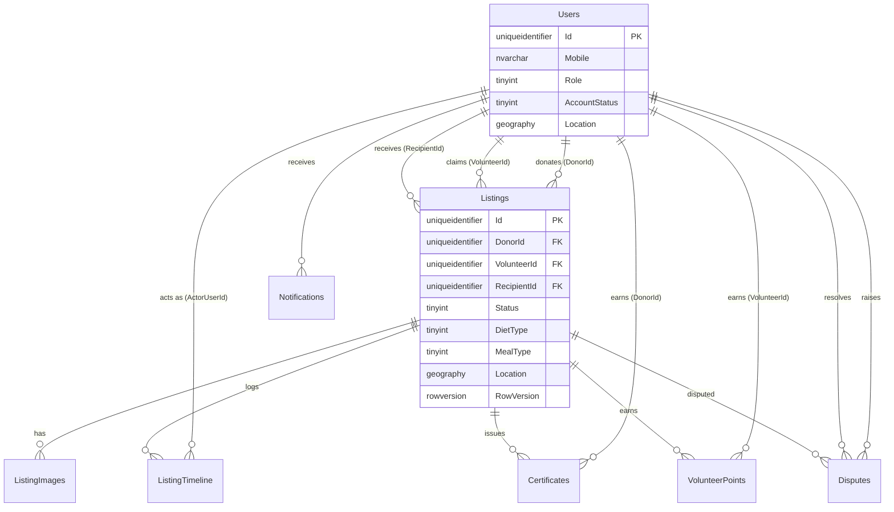

# FoodBridge — Architecture

> Filled in progressively as phases land. See `docs/PLAN.md` for phase status.

## Solution structure

```
FoodBridge.sln
├── src/
│   ├── FoodBridge.Api/              Controllers (15), SignalR Hubs (2), Middleware (2), Program.cs / DI root
│   ├── FoodBridge.Application/      Service interfaces + implementations, DTOs, FluentValidation validators, Common helpers
│   ├── FoodBridge.Domain/           Entities, Enums, domain exceptions, ListingStateMachine. Zero external dependencies.
│   ├── FoodBridge.Infrastructure/   Dapper repositories, IDbConnectionFactory, adapters (Sms, Storage, Pdf, Geocoding, Tracking)
│   └── FoodBridge.Migrations/       FluentMigrator migrations — console-runnable and run on API startup
├── docs/                            ARCHITECTURE.md, API-CONTRACTS.md, PLAN.md (this file)
└── FoodBridge.http                  REST Client sample requests, one section per phase/resource
```

Ten phases landed in order (Phase 0 scaffold through Phase 9 Admin, then this Phase 10 hardening pass); `docs/PLAN.md` tracks each phase's acceptance criteria as they were verified live.

## Layer responsibilities & dependency rule

`Api → Application → Domain`; `Infrastructure → Application + Domain`; `Api → Infrastructure` only inside `Program.cs`'s DI composition — no controller, service, or hub ever references an `Infrastructure` type directly. `Domain` references nothing outside the BCL, so `ListingStateMachine`, entities, enums, and domain exceptions are usable from every other layer without pulling in Dapper, ASP.NET Core, or SignalR.

- **Api** — `Controllers` translate HTTP ↔ service calls only (`BaseController.HandleResult`/`HandlePagedResult` keep every action 3–5 lines); `Hubs` are the SignalR equivalent of controllers; `Program.cs` is the only file allowed to reference both `Application` and `Infrastructure` (DI registration) and is also where all cross-cutting ASP.NET Core config lives (Kestrel limits, CORS, JWT bearer options, middleware order).
- **Application** — one service per bounded concern (`ListingService`, `VolunteerListingService`, `RecipientListingService`, `AdminService`, ...), each depending only on repository *interfaces* (`Application/Abstractions`) and other services/helpers in `Application/Common`. Contains DTOs (`Requests`/`Responses`), FluentValidation validators, and the `Result<T>` pattern services use to report expected business failures without throwing.
- **Domain** — `Entities`, `Enums`, domain exceptions (`NotFoundException`, `BusinessRuleException`, `ConflictException`, `RateLimitExceededException`), and `StateMachines/ListingStateMachine`. No knowledge of HTTP, SQL, or DI.
- **Infrastructure** — `Repositories` (Dapper, one interface implementation each), `IDbConnectionFactory`/`SqlConnectionFactory`, and the swappable adapters CLAUDE.md's Open/Closed guidance calls for: `MockSmsProvider`, `LocalFileStorage`, `QuestPdfCertificateGenerator`, `MockGeocodingProvider`, `InMemoryTrackingStore`, `InMemoryTokenDenylist`.
- **One documented exception to the "Infrastructure implements Application interfaces" pattern**: `SignalRNotificationDispatcher` (implementing `INotificationDispatcher`) lives in `Api`, not `Infrastructure`, because it depends on `IHubContext<NotificationsHub>` — `NotificationsHub` is an ASP.NET Core SignalR endpoint, the same category of thing as a Controller. Wiring in `Program.cs` is identical to every other provider (`AddScoped<INotificationDispatcher, SignalRNotificationDispatcher>()`); only the implementation's assembly differs.

## SOLID in practice

- **S — Single Responsibility.** Controllers never contain business logic or SQL — every action is a validator call plus one service call, translated by `BaseController`. Donor-side, Volunteer-side, and Recipient-side listing actions are three separate controllers/services (`ListingsController`/`ListingService`, `VolunteerListingsController`/`VolunteerListingService`, `RecipientListingsController`/`RecipientListingService`) even though all three operate on the same `Listing` aggregate — a donor cancelling their own listing and a volunteer claiming someone else's are different reasons to change.
- **O — Open/Closed.** Every provider CLAUDE.md calls out is an interface with a swappable implementation, with zero consumer changes needed to swap it: `ISmsProvider`/`MockSmsProvider`, `IFileStorage`/`LocalFileStorage`, `IPdfGenerator`/`QuestPdfCertificateGenerator`, `IGeocodingProvider`/`MockGeocodingProvider`, `INotificationDispatcher`/`SignalRNotificationDispatcher`. A real SMS gateway or Google Maps geocoder plugs in by adding one new class and one `Program.cs` line, not by editing the services that consume them.
- **L — Liskov.** No interface implementation anywhere throws `NotImplementedException` — verified by grep (none found). Every `Result<T>`-returning service method can be substituted with a fake in a test without changing caller expectations, since the contract (`IsSuccess`/`Data`/`Message`/`Errors`) is uniform across every service.
- **I — Interface Segregation.** Read-heavy cross-cutting concerns got their own narrow interfaces instead of bloating the aggregate repositories: `IRecipientReader` (not a new `IUserRepository` method), `ILeaderboardReader`, `IReportsReader`, `INotificationRepository`, `ICertificateRepository`, `IAdminRepository`, `IDisputeRepository` are all separate from `IListingRepository`/`IUserRepository`, matching CLAUDE.md's explicit "`IListingRepository` must not contain user methods" / "`ILeaderboardReader`" example verbatim.
- **D — Dependency Inversion.** Every service takes repository/helper *interfaces* through its constructor (`IListingRepository`, `IClock`, `ICurrentUser`, `IRecipientMatcher`, ...) — none of them `new` up a repository, a `DateTime.UtcNow` call, or an HTTP context accessor directly. `Program.cs` is the sole place concrete `Infrastructure`/`Api` types get bound to those interfaces.

## Listing lifecycle (state machine)

Single source of truth: `FoodBridge.Domain.StateMachines.ListingStateMachine`. Any transition not listed throws `BusinessRuleException` → 422.

```
Pending  → Claimed (volunteer claim)     | Cancelled (donor) | Expired (job)
Claimed  → PickedUp (volunteer + photo)  | Pending (volunteer un-claims — optional)
PickedUp → Delivered (volunteer + photo, recipient matched)
         → Confirmed (volunteer + photo, NO recipient matched)  → points + certificate + notifications
Delivered→ Confirmed (recipient)         → points + certificate + notifications
```

`PickedUp` has two legal exits because a donation can complete two ways, decided by whether
the listing has a `RecipientId` — never by the caller. With a recipient matched, the volunteer
reports `Delivered` and the recipient confirms receipt. With none (the Recipient role is
disabled — see the Phase 15 entry below), the food went to a drop-off location and nobody is
left to confirm, so the volunteer's `confirm-delivery` completes the donation itself. Both
exits award the same points and issue the same certificate via the same
`IListingRepository.ConfirmReceiptAsync` transaction.

Recipient-reject (Phase 6) clears `RecipientId`/re-assigns without changing `Status` away from `PickedUp` — it is deliberately *not* modeled as a transition in `ListingStateMachine`, since the status itself doesn't change.

Phase 4 also enforces a related-but-distinct rule directly in `ListingService` (not via the state machine, since it isn't a transition): a listing can only be edited (`PUT`) or have images added while `Status == Pending`; both throw `BusinessRuleException` → 422 otherwise.

Phase 5 (`VolunteerListingService`) drives the `Pending → Claimed`, `Claimed → PickedUp`, and `PickedUp → Delivered` transitions:
- **Claim is deliberately *not* routed through `ListingStateMachine`.** A concurrent claim race is a conflict-with-current-state (409), not an invalid-transition-attempt (422) — see the dedicated decision-log entry below. `confirm-pickup`/`confirm-delivery` *do* go through `ListingStateMachine.EnsureCanTransition` (→ 422 on a wrong status), matching the phase's "invalid transitions blocked by ListingStateMachine" acceptance criterion.
- `confirm-pickup` auto-assigns `RecipientId` via `RecipientMatcher` if not already set (nearest available Verified recipient by geography distance); if none is available the pickup still succeeds (status still advances) but `RecipientId` stays null.
- `confirm-delivery` additionally requires `RecipientId` to be set — `BusinessRuleException` (422) otherwise, since delivering to nobody isn't meaningful.

Phase 6 (`RecipientListingService`) covers `accept`/`reject` (both same-status, `PickedUp → PickedUp`, gated by `EnsureAwaitingDecision` rather than `ListingStateMachine` — see above) and drives the final `Delivered → Confirmed` transition via `confirm-receipt`:
- **`accept` is purely a timeline entry.** It doesn't change `Status`, `RecipientId`, or anything else — it just records that the matched recipient has acknowledged the incoming delivery. Matches the earlier prototype-comparison decision ("recipient-accept not changing listing status").
- **`reject` re-matches via `RecipientMatcher`, excluding every recipient who has already rejected *this* listing, not just the current one.** See the dedicated decision-log entry below — excluding only the current recipient causes two recipients to ping-pong forever instead of ever reaching "no recipient available".
- **`confirm-receipt` is the one operation that fans out beyond `Listings`/`ListingTimeline`.** In one transaction (`IListingRepository.ConfirmReceiptAsync`): `Listings.Status → Confirmed`, a `ListingTimeline` row, a `VolunteerPoints` row, a `Certificates` row (with a generated `CertificateNumber`, `PdfUrl` left null until Phase 8 renders it), and one `Notifications` row each for the donor and the volunteer. All five writes share one `IDbTransaction` — see the atomicity decision-log entry below.

## Data dictionary

All tables use `Id uniqueidentifier` primary keys defaulted to `NEWSEQUENTIALID()` unless noted. `CreatedAtUtc`/`UpdatedAtUtc` are `datetime2`, always UTC.

### Users
| Column | Type | Notes |
|---|---|---|
| Id | uniqueidentifier PK | |
| Mobile | nvarchar(15) | unique |
| Name | nvarchar(200) | |
| Role | tinyint | see enum table |
| City | nvarchar(100) | nullable |
| Address | nvarchar(500) | nullable |
| Latitude / Longitude | decimal(9,6) | nullable |
| Location | geography | nullable; spatial index `SIX_Users_Location` |
| RecipientType | tinyint | nullable; recipients only — see enum table. Added post-Phase-1 in `M202607230900_AddRecipientTypeToUsers` |
| CapacityMeals | int | nullable; recipients only |
| IsAvailable | bit | default 1 |
| AccountStatus | tinyint | see enum table |
| AvatarUrl | nvarchar(500) | nullable |
| IsDeleted | bit | soft delete |

### OtpCodes
| Column | Type | Notes |
|---|---|---|
| Id | uniqueidentifier PK | |
| Mobile | nvarchar(15) | |
| CodeHash | nvarchar(256) | never plaintext |
| ExpiresAtUtc | datetime2 | |
| Attempts | int | default 0 |
| ConsumedAtUtc | datetime2 | nullable |

### DonorAddresses
A donor's saved address book — independent of `Users.Address` (one profile address) and `Listings.PickupAddress` (still freeform per listing). Added in `M202607260900_CreateDonorAddressesTable`. No `IsDeleted` (hard delete — see decisions log) and no `geography` column (never used in a distance query; `nearby` still runs entirely off `Listings.Location`).
| Column | Type | Notes |
|---|---|---|
| Id | uniqueidentifier PK | |
| DonorId | uniqueidentifier FK → Users | index `IX_DonorAddresses_DonorId` |
| Label | nvarchar(100) | e.g. "Main Branch" |
| Address | nvarchar(500) | |
| Latitude / Longitude | decimal(9,6) | |
| IsDefault | bit | default 0; at most one per donor, enforced in `DonorAddressService`, not a DB constraint |

### Listings
| Column | Type | Notes |
|---|---|---|
| Id | uniqueidentifier PK | |
| DonorId | uniqueidentifier FK → Users | |
| Title | nvarchar(200) | |
| FoodType | nvarchar(100) | freeform |
| DietType | tinyint | nullable; see enum table. Added in `M202607231100_AddDietTypeAndMealTypeToListings` |
| MealType | tinyint | nullable; see enum table. Added in `M202607231100_AddDietTypeAndMealTypeToListings` |
| QuantityMeals | int | |
| FreshnessTag | tinyint | see enum table |
| PreparedAtUtc | datetime2 | nullable |
| PickupDeadlineUtc | datetime2 | |
| PickupAddress | nvarchar(500) | |
| Latitude / Longitude | decimal(9,6) | |
| Location | geography | spatial index `SIX_Listings_Location` |
| Status | tinyint | see enum table; index `IX_Listings_Status_PickupDeadlineUtc` |
| VolunteerId | uniqueidentifier FK → Users | nullable |
| RecipientId | uniqueidentifier FK → Users | nullable |
| EstimatedPickupAtUtc | datetime2 | nullable; volunteer's optional flexible-ETA commitment on claim, cleared on unclaim. Added in `M202607271002_AddEstimatedPickupAtUtcToListings` |
| FoodSafetyAcceptedAtUtc | datetime2 | nullable; when the donor confirmed the food is safe and its quality is their responsibility. Set at creation from `IClock`, never updated. Null **only** for listings predating the requirement — never for one that skipped it. Added in `M202607311100_AddFoodSafetyAcceptanceToListings` |
| RowVersion | rowversion | optimistic concurrency for claim |
| IsDeleted | bit | soft delete |

### ListingImages
| Column | Type | Notes |
|---|---|---|
| Id | uniqueidentifier PK | |
| ListingId | uniqueidentifier FK → Listings | |
| ImageUrl | nvarchar(500) | |

### ListingTimeline
Append-only event log — no `UpdatedAtUtc` (rows are never modified).
| Column | Type | Notes |
|---|---|---|
| Id | uniqueidentifier PK | |
| ListingId | uniqueidentifier FK → Listings | |
| FromStatus | tinyint | nullable (null on creation) |
| ToStatus | tinyint | |
| ActorUserId | uniqueidentifier FK → Users | nullable — null for system-initiated events (e.g. automatic expiry). Made nullable in Phase 7 via `M202607241200_MakeListingTimelineActorNullable` |
| Note | nvarchar(1000) | nullable |
| PhotoUrl | nvarchar(500) | nullable |
| CreatedAtUtc | datetime2 | |

### Notifications
| Column | Type | Notes |
|---|---|---|
| Id | uniqueidentifier PK | |
| UserId | uniqueidentifier FK → Users | index `IX_Notifications_UserId_IsRead` |
| Type | nvarchar(50) | free-form category, e.g. `ListingClaimed` |
| Title | nvarchar(200) | |
| Body | nvarchar(1000) | |
| PayloadJson | nvarchar(MAX) | nullable |
| IsRead | bit | default 0 |

### DropOffLocations
The shared pool of places food can be taken: admin-curated partner sites **plus** recipient hotspots
volunteers add at confirm-delivery. Added in `M202607271000_CreateDropOffLocationsTable`; widened in
`M202607301000_AddSourceToDropOffLocations`.
| Column | Type | Notes |
|---|---|---|
| Id | uniqueidentifier PK | |
| Name | nvarchar(200) | |
| Address | nvarchar(500) | falls back to the name for a field-discovered spot with no street address |
| Latitude / Longitude | decimal(9,6) | |
| Location | geography | spatial index `SIX_DropOffLocations_Location` |
| City | nvarchar(100) | nullable; null for volunteer-added spots |
| IsActive | bit | default 1; excluded-not-deleted when toggled off. Inactive spots never appear in hotspots |
| Source | tinyint | see enum table. Default 1 (Admin), which correctly backfills every pre-existing row |
| CreatedByUserId | uniqueidentifier FK → Users | nullable; null for admin-seeded rows predating the column |

### UserDocuments
Verification evidence, so an admin reviewing an account has more than a name and an OTP-verified
mobile to judge. Added in `M202607311000_CreateUserDocumentsTable`.
| Column | Type | Notes |
|---|---|---|
| Id | uniqueidentifier PK | |
| UserId | uniqueidentifier FK → Users | |
| Type | tinyint | see enum table |
| FileUrl | nvarchar(500) | served from `/uploads`, like avatars |
| OriginalFileName | nvarchar(260) | nullable; the uploader's filename, a weak sanity signal for the reviewer |
| | | **unique** `UX_UserDocuments_UserId_Type` — re-uploading replaces, so there's only ever one current copy per type |

### DropOffDeliveries
Append-only log, one row per completed drop-off — no `UpdatedAtUtc` (rows are never modified). Drives
the post-delivery cooldown and hotspot intensity. Added in `M202607301001_CreateDropOffDeliveriesTable`.
| Column | Type | Notes |
|---|---|---|
| Id | uniqueidentifier PK | |
| DropOffLocationId | uniqueidentifier FK → DropOffLocations | index `IX_DropOffDeliveries_DropOffLocationId_DeliveredAtUtc` (DESC) |
| VolunteerId | uniqueidentifier FK → Users | |
| ListingId | uniqueidentifier FK → Listings | **unique** `UX_DropOffDeliveries_ListingId` — a listing is delivered once, so a retry can't double-log |
| MealsCount | int | copied from the listing so intensity needs no join |
| DeliveredAtUtc | datetime2 | the cooldown and "last served" both read this |

### Certificates
| Column | Type | Notes |
|---|---|---|
| Id | uniqueidentifier PK | |
| CertificateNumber | nvarchar(30) | unique; format `FB-{yyyyMM}-{seq:D5}` |
| DonorId | uniqueidentifier FK → Users | |
| ListingId | uniqueidentifier FK → Listings | |
| MealsCount | int | |
| IssuedAtUtc | datetime2 | |
| PdfUrl | nvarchar(500) | nullable until first render |

### VolunteerPoints
Insert-only ledger; leaderboard = `SUM(Points) GROUP BY VolunteerId`.
| Column | Type | Notes |
|---|---|---|
| Id | uniqueidentifier PK | |
| VolunteerId | uniqueidentifier FK → Users | |
| ListingId | uniqueidentifier FK → Listings | |
| Points | int | |
| Reason | nvarchar(200) | |

### Disputes
| Column | Type | Notes |
|---|---|---|
| Id | uniqueidentifier PK | |
| ListingId | uniqueidentifier FK → Listings | |
| RaisedByUserId | uniqueidentifier FK → Users | |
| Reason | nvarchar(1000) | |
| Status | tinyint | see enum table |
| ResolvedByUserId | uniqueidentifier FK → Users | nullable |
| ResolutionNote | nvarchar(1000) | nullable |

### Enum value tables

**Users.Role**
| Value | Name |
|---|---|
| 1 | Donor |
| 2 | Volunteer |
| 3 | Recipient |
| 4 | Admin |

**Users.AccountStatus**
| Value | Name |
|---|---|
| 1 | Pending |
| 2 | Verified |
| 3 | Suspended |

**Users.RecipientType** (nullable; recipients only)
| Value | Name |
|---|---|
| 1 | Individual |
| 2 | Organization |

**Listings.FreshnessTag**
| Value | Name |
|---|---|
| 1 | JustCooked |
| 2 | FewHoursOld |
| 3 | Packaged |

**Listings.DietType** (nullable)
| Value | Name |
|---|---|
| 1 | Veg |
| 2 | NonVeg |

**Listings.MealType** (nullable)
| Value | Name |
|---|---|
| 1 | Breakfast |
| 2 | Lunch |
| 3 | Dinner |
| 4 | Snacks |

**Listings.Status**
| Value | Name |
|---|---|
| 1 | Pending |
| 2 | Claimed |
| 3 | PickedUp |
| 4 | Delivered |
| 5 | Confirmed |
| 6 | Expired |
| 7 | Cancelled |
| 8 | Rejected |

**Disputes.Status**
| Value | Name |
|---|---|
| 1 | Open |
| 2 | Resolved |

**DropOffLocations.Source**
| Value | Name |
|---|---|
| 1 | Admin |
| 2 | Volunteer |

**UserDocuments.Type**
| Value | Name |
|---|---|
| 1 | IdProof |
| 2 | Selfie |

### Entity relationship diagram


```mermaid
erDiagram
    Users ||--o{ Listings : "donates (DonorId)"
    Users ||--o{ Listings : "claims (VolunteerId)"
    Users ||--o{ Listings : "receives (RecipientId)"
    Users ||--o{ ListingTimeline : "acts as (ActorUserId)"
    Users ||--o{ Notifications : "receives"
    Users ||--o{ Certificates : "earns (DonorId)"
    Users ||--o{ VolunteerPoints : "earns (VolunteerId)"
    Users ||--o{ Disputes : "raises"
    Users ||--o{ Disputes : "resolves"
    Listings ||--o{ ListingImages : "has"
    Listings ||--o{ ListingTimeline : "logs"
    Listings ||--o{ Certificates : "issues"
    Listings ||--o{ VolunteerPoints : "earns"
    Listings ||--o{ Disputes : "disputed"

    Users {
        uniqueidentifier Id PK
        nvarchar Mobile
        tinyint Role
        tinyint AccountStatus
        geography Location
    }
    Listings {
        uniqueidentifier Id PK
        uniqueidentifier DonorId FK
        uniqueidentifier VolunteerId FK
        uniqueidentifier RecipientId FK
        tinyint Status
        tinyint DietType
        tinyint MealType
        geography Location
        rowversion RowVersion
    }
```

### Seed data
Development-only (`[Profile("Development")]`), demo city: Ahmedabad, Gujarat. 1 admin, 2 donors, 3 volunteers, 2 pre-verified recipients, 8 listings spanning Pending/Claimed/PickedUp/Delivered/Confirmed/Expired.

**Dev login shortcut**: with `appsettings.Development.json`'s `Otp:FixedDevelopmentCode` set (default `123456`), every `send-otp` issues that fixed code instead of a random one — skip checking the console/log, just call `verify-otp` with `123456` directly. Seeded mobiles, one per role:

| Mobile | Name | Role | Notes |
|---|---|---|---|
| 9999900000 | FoodBridge Admin | Admin | |
| 9999900001 | Green Leaf Restaurant | Donor | |
| 9999900002 | Sunrise Caterers | Donor | |
| 9999900003 | Raj Patel | Volunteer | |
| 9999900004 | Priya Shah | Volunteer | |
| 9999900005 | Aman Verma | Volunteer | |
| 9999900006 | Hope NGO | Recipient | pre-`Verified`, capacity 200 |
| 9999900007 | Asha Foundation | Recipient | pre-`Verified`, capacity 150 |

## Sequence diagram — happy path

```mermaid
sequenceDiagram
    actor Donor
    actor Volunteer
    actor Recipient
    participant API as FoodBridge API
    participant DB as SQL Server
    participant Hub as NotificationsHub

    Donor->>API: POST /api/listings (create)
    API->>DB: one transaction: INSERT Listings (Status=Pending) + ListingTimeline + 1x Notifications per nearby Volunteer
    API->>Hub: DispatchAsync (after commit)
    Hub-->>Volunteer: ReceiveNotification (NewListingNearby)
    Volunteer->>API: GET /api/listings/nearby
    API->>DB: nearby Pending listings by geography distance
    Volunteer->>API: POST /api/listings/{id}/claim
    API->>DB: conditional UPDATE ... WHERE Status=Pending (Pending→Claimed)
    Volunteer->>API: POST /api/listings/{id}/confirm-pickup (photo)
    API->>DB: RecipientMatcher finds nearest available Verified recipient; Claimed→PickedUp
    Volunteer->>API: POST /api/listings/{id}/confirm-delivery (photo)
    API->>DB: PickedUp→Delivered
    Recipient->>API: POST /api/listings/{id}/accept
    Recipient->>API: POST /api/listings/{id}/confirm-receipt
    API->>DB: one transaction: Delivered→Confirmed + VolunteerPoints + Certificates + 2x Notifications
    API->>Hub: DispatchAsync (after commit)
    Hub-->>Donor: ReceiveNotification (DonationConfirmed)
    Hub-->>Volunteer: ReceiveNotification (PointsAwarded)
```

If the recipient rejects instead of accepting, `RecipientMatcher` re-runs excluding everyone who has already rejected this listing, looping back to "awaiting decision" for the newly-matched recipient (or `recipientId: null` if none remain). If the volunteer never claims before `PickupDeadlineUtc`, `ListingExpiryBackgroundService` flips `Pending → Expired` on its next 30-second sweep instead.

## Real-time (SignalR) contract

Both hubs require a JWT — the standard `Authorization: Bearer` header for plain requests, or an `access_token` query-string parameter for the hub connection itself, since WebSocket/SSE transports can't set custom headers during the handshake. `Program.cs`'s `JwtBearerEvents.OnMessageReceived` only honors that query-string fallback for paths under `/hubs`; everywhere else it's ignored.

### `/hubs/notifications` (`NotificationsHub`)
- On connect, the server adds the connection to a per-user group (`user:{userId}`, derived from the `sub` claim) — no client action needed.
- **Server → client event**: `ReceiveNotification(NotificationResponse)` — pushed by `SignalRNotificationDispatcher` immediately after a notification is persisted (and always after its transaction commits). Every flow in the Phase 16 table above pushes through here: listing creation, claim, unclaim, confirm-pickup, completion, the recipient request/reject flows, and the expiry background sweep. Best-effort: if the user has no open connection, they only see it via `GET /api/notifications`.
- No client-invokable methods.

### `/hubs/tracking` (`TrackingHub`)
- **Client → server**: `JoinTracking(listingId)` / `LeaveTracking(listingId)` — join/leave the `listing:{listingId}` group. `JoinTracking` re-validates the caller is the listing's donor, assigned volunteer, or matched recipient (via `ITrackingService.GetTrackingAsync`'s ownership check) and throws `HubException` otherwise.
- **Client → server**: `UpdateLocation(listingId, latitude, longitude)` — assigned-volunteer only (`HubException` otherwise); stores the reading in `ITrackingStore` and broadcasts it.
- **Server → client event**: `LocationUpdated(TrackingResponse)` — broadcast to the `listing:{listingId}` group whenever `UpdateLocation` succeeds.
- **REST fallback**: `GET /api/listings/{id}/track` returns the same last-known reading (or null) for clients that aren't connected.

Verified live with a real two-connection `Microsoft.AspNetCore.SignalR.Client` harness (not just code review): both hubs authenticate correctly over the query-string token, `ReceiveNotification` reaches only the intended user's connection (donor and volunteer each got *only* their own notification out of the same `confirm-receipt` call), and `LocationUpdated` reaches a donor who joined a listing's tracking group after the assigned volunteer reported a position.

## Decisions & tradeoffs log

- **FluentMigrator `[Profile("Development")]` re-runs unconditionally.** Profile-tagged migrations execute once via the normal version-tracked sequence *and* again via `ApplyProfiles()` on every `MigrateUp()` call — by design, meant for idempotent reference-data refreshes. The seed migration (`M202607221010_SeedDevelopmentData`) guards its `Up()` with an `IF EXISTS ... RETURN` check on a sentinel row so re-running it (or starting the app repeatedly) never throws a duplicate-key error.
- **`TrustServerCertificate=True` required for the LAN SQL Express instance.** `Microsoft.Data.SqlClient` defaults to `Encrypt=Mandatory`; without trusting the server's self-signed cert, the TLS handshake fails before login is even attempted. Fine for local/dev; a real cert (or `Encrypt=false` only on a trusted network) should replace this before any non-dev deployment.
- **Middleware order: `RequestLoggingMiddleware` must wrap `ExceptionHandlingMiddleware`, not the other way round.** If the exception handler is outermost, the logging middleware's `finally` block observes the response mid-unwind — before the handler has set the final status code — and logs the pre-exception status (e.g. `200`) instead of the real one (`500`).
- **`RateLimitExceededException` (429) added alongside `BusinessRuleException` (422).** Phase 2's spec calls for send-otp's rate limit to return 429 while verify-otp's attempt limit returns 422 — two different "expected failure" shapes. Rather than overload `BusinessRuleException`, a distinct exception+mapping keeps the 429 case explicit; the 422 cases go through `Result.Failure` instead of an exception at all (per the "services don't throw for expected failures" rule) since `BaseController.HandleResult` only ever produces 200/422.
- **`JwtBearerOptions.MapInboundClaims = false` is required.** `System.IdentityModel.Tokens.Jwt`'s default inbound claim mapping silently rewrites short claim names like `sub` to the legacy long-form `ClaimTypes.NameIdentifier` URI on the server side after validation — so a token issued with a `sub` claim reads back as null via `User.FindFirstValue("sub")` unless this is set. Caught via `/api/auth/me` returning 500 instead of 401/200.
- **Registration is a two-step OTP → session-token → register flow, not a DB-backed session table.** `verify-otp` for a not-yet-existing mobile returns a short-lived (10 min) signed token (`PasswordlessSessionHelper`, same JWT mechanics as real auth tokens but carrying only a `mobile` + `purpose=registration` claim, no `sub`). `register` validates that token instead of re-verifying the OTP, keeping the OTP single-use while avoiding a stateful session store.
- **`dailyRequirement` (mentioned in the original registration spec for recipients) is not persisted.** The Phase 1 `Users` schema only has `CapacityMeals` — no column exists for it, and adding one wasn't asked for, so `RegisterRequest` omits it.
- **Prototype comparison (`docs/FoodBridge_Bootstrap_Prototype 1.html`) drove three schema/scope decisions**, made after comparing its UI flows against the Phase 1–2 implementation and the remaining phase plan:
  1. **`Users.RecipientType`** (Individual/Organization) added via `M202607230900_AddRecipientTypeToUsers`, wired into `RegisterRequest`/`AuthService`/`UserResponse` immediately since it's a Phase 2 (registration) concern. The prototype distinguishes household recipients from NGO/org recipients with different meaning for their capacity field (household size vs. daily serving capacity) — `CapacityMeals` stays a single int either way; only the label/interpretation differs by `RecipientType`.
  2. **Listings get `DietType` (Veg/Non-Veg) and `MealType` (Breakfast/Lunch/Dinner/Snacks) columns**, on top of the freeform `FoodType` text column from Phase 1. The prototype tracks these as two distinct structured fields, enabling future filtering by diet/meal-slot that a single text field can't support. Implemented in Phase 4 via `M202607231100_AddDietTypeAndMealTypeToListings` (both nullable tinyint).
  3. **Phase 6's recipient-reject will implement simple auto-reassignment** (immediately reassign to the nearest other available Verified recipient via `RecipientMatcher`), a scope increase from the original "volunteer manually re-picks, full auto-reassignment is roadmap-only" note — the prototype demos live auto-reassignment on reject. *Not yet implemented — deferred to Phase 6 start.*
  - Other prototype behaviors were reviewed and intentionally left unchanged: hard-delete-on-cancel (prototype has no real backend, soft-cancel + audit trail is correct for a real one), recipient-accept not changing listing status (matches the original Phase 6 spec exactly), and all photo/GPS/map features being cosmetic-only (the real `IFileStorage` + geography-column design already exceeds the mock).
- **`wwwroot/uploads` must exist *before* `WebApplication.CreateBuilder(args)` runs, not just before `UseStaticFiles()`.** `IWebHostEnvironment.WebRootFileProvider` is snapshotted during builder construction; if `wwwroot` is missing at that instant, it's locked in as a `NullFileProvider` for the app's lifetime — creating the directory afterward (even before `UseStaticFiles()`) doesn't fix it. `Program.cs` now creates the uploads directory as the very first statement, before the builder is created. Caught because the avatar-upload endpoint returned a URL that 404'd.
- **Authorization for "self or admin" / "self only" / role-restricted actions lives in the service layer (`UserService`), not `[Authorize(Policy=...)]` attributes.** Policies answer "what role is the caller," not "does the caller own this specific resource," so per-resource checks use the injected `ICurrentUser` inside the service and throw `UnauthorizedAccessException` (→ 403) — consistent with controllers staying thin translators.
- **`ListingStateMachine` lives in `Domain`, not `Application`.** It's pure logic over `ListingStatus`/`BusinessRuleException` (both already in `Domain`) with zero external dependencies, so it satisfies the Domain layer's "zero dependencies" rule and is reusable by any future consumer (services, background jobs) without an `Application` reference. Contrast with the Phase-4 "listing must be Pending to edit" check, which is *not* in the state machine — it isn't a status transition, so it's a plain `BusinessRuleException` thrown inline in `ListingService`.
- **`PaginationHelper`, `PagedResult<T>`, and `BaseController.HandlePagedResult` added in Phase 4** (first paginated endpoint: `GET /api/listings`). `PagedResult<T>` (Application/Common) carries `Items`/`TotalCount`/normalized `Page`/`PageSize` through the `Result<T>` pipeline so the service — not the controller — owns clamping page/pageSize (via `PaginationHelper.Normalize`, default 20/max 100) and the controller just calls `HandlePagedResult` to project it into a `PagedResponse<T>`. `PagedResponse<T>.Fail` was added (with `new` to intentionally shadow the inherited `ApiResponse<IReadOnlyList<T>>.Fail`, since it must return the derived type) for the theoretical failure path, even though no current Listings query actually reaches it other than an unrecognized `status` filter string.
- **Listing image uploads reuse `IFileStorage`/`LocalFileStorage` as-is** (5MB/JPG-PNG limit, distinct from the avatar path's 2MB) — no new storage abstraction needed; `ListingImages` rows just record the returned URL per listing.
- **Claim concurrency uses a conditional `UPDATE ... WHERE Status = Pending` (checking `@@ROWCOUNT`/rows-affected), not the `Listings.RowVersion` column.** `Status` is itself the natural version for this specific race — exactly one of two concurrent claims flips `Pending → Claimed`, the other affects zero rows. This is simpler for API consumers than round-tripping a `RowVersion` token through every nearby/detail response just to submit it back on claim, and satisfies the "two parallel claims: exactly one 200, one 409" acceptance criterion directly (verified live with two real concurrent requests). The loser gets `ConflictException` → 409, deliberately not routed through `ListingStateMachine`/`BusinessRuleException` (422) — claiming a listing that's no longer `Pending` (whether due to a race or because it was `Cancelled` days ago) is a conflict-with-current-state, not an attempted state-machine transition. `RowVersion` remains available on the table for a future optimistic-concurrency need (e.g. concurrent donor edits), just unused by claim.
- **`GET /api/listings/nearby` defensively excludes listings whose `PickupDeadlineUtc` has already passed**, even though they're still `Status = Pending` (the Phase 7 expiry job hasn't flipped them yet). Not explicitly requested, but showing a volunteer an opportunity they can no longer act on would be a poor result for a query literally named "nearby" — caught during live verification when the Phase 1 seed listings' deadlines (computed relative to whenever the seed migration originally ran) had already elapsed by the time Phase 5 was tested, correctly returning zero results for them.
- **`GeoHelper.PointFromLatLngFragment` (Infrastructure/Common) introduced in Phase 5**, the first phase with more than one geography-point call site (`ListingRepository`'s create/update/nearby-origin, `RecipientReader`'s nearest-recipient lookup). Matches the helper CLAUDE.md names explicitly; overdue since Phase 1/3 each inlined the same `geography::Point(@Latitude, @Longitude, 4326)` literal. Implemented as a `public const string` SQL fragment (not a value-returning method) since Dapper has no native `geography` CLR binding — the point must always be constructed in-SQL from `@Latitude`/`@Longitude` parameters, never passed as a single parameter value.
- **`IRecipientReader`/`RecipientReader` is a narrow read-only interface, not a new method on `IUserRepository`.** Matches the ISP guidance directly ("split read-heavy vs write-heavy concerns where natural") — recipient-matching is a Listings-side concern reading Users data, not a Users-aggregate operation, so it lives in its own interface rather than bloating `IUserRepository` (or, worse, `IListingRepository`, which CLAUDE.md explicitly says must not contain user methods). `RecipientMatcher` (Application/Listings) wraps it so Phase 6's reject-reassignment can grow the matching logic (e.g. excluding previously-tried recipients) without touching the repository contract.
- **Volunteer-side listing actions split into their own `IVolunteerListingService`/`VolunteerListingService` and `VolunteerListingsController`**, both still operating on the same `Listing` aggregate/`IListingRepository` as the Donor-side `ListingService`/`ListingsController`. Donor-side and volunteer-side changes are different reasons to change (SRP), and the two controllers need different class-level `[Authorize(Policy = ...)]` attributes (`DonorOnly` vs `VolunteerOnly`) — ASP.NET Core attribute routing allows both to map under `api/listings` without collision since their route templates don't overlap (`{id:guid}` constraints exclude literal segments like `nearby`).
- **`OtpSettings.FixedDevelopmentCode` added so local dev/testing doesn't need to read the console for every OTP.** `AuthService.SendOtpAsync` uses it in place of `OtpGenerator.GenerateCode()` whenever it's set; verification logic (hash check, attempt counting, expiry) is completely unchanged — only the generated code itself is fixed, so a wrong code is still rejected. Kept safely dev-only two ways: it's only present in `appsettings.Development.json`, *and* `Program.cs` only calls `Configure<OtpSettings>(...)` inside `if (builder.Environment.IsDevelopment())` — so even if the `Otp` key ever leaked into a non-dev config file, the section wouldn't be bound and `AuthService` would fall back to a random code. Required adding an explicit `Microsoft.Extensions.Options` package reference to `FoodBridge.Application` (previously only in `Infrastructure`), since `IOptions<T>` wasn't referenced there yet.
- **`confirm-receipt`'s four-table atomic write lives in `IListingRepository.ConfirmReceiptAsync`, not in separate `INotificationRepository`/`ICertificateRepository`/`IVolunteerPointsRepository` classes.** `BaseRepository.ExecuteInTransactionAsync` scopes one connection/transaction to one repository method — CLAUDE.md's own illustrative example of what it's for is literally "claim listing + insert timeline event + insert notification" as a single cohesive write. Splitting the four inserts across separate repository instances would mean four separate connections/transactions, breaking the "all-or-nothing" requirement. Dedicated `INotificationRepository`/`ICertificateRepository` (list/detail/mark-read/leaderboard reads) can still be added in Phases 7/8 without conflict — those are independent read paths, not part of this one atomic write.
- **Certificate numbering (`FB-{yyyyMM}-{seq:D5}`) uses a same-transaction `SELECT COUNT(*) ... LIKE 'FB-{month}-%'` for the per-month sequence, not a SQL Server `SEQUENCE` object.** A `SEQUENCE` is a single global monotonic counter and doesn't naturally reset per calendar month the way the `seq:D5` format implies; building a per-month-resetting sequence properly would need more machinery than a donation certificate number warrants. The count-based approach has a known, accepted race: two `confirm-receipt` calls in the same millisecond, same month, could both read the same count and collide on the table's `UNIQUE` constraint on the second insert, surfacing as an uncaught 500. Acceptable for this platform's actual concurrency (confirms are rare, human-paced events); a production system handling real volume would use a proper per-month sequence table with row locking instead.
- **`VolunteerPoints` awards a simple 1 point per meal delivered (`listing.QuantityMeals * PointsPerMeal`).** No point formula is specified anywhere in the spec or prototype; this is a plain, explicit assumption (not hidden in a magic number — see `RecipientListingService.PointsPerMeal`) chosen because it ties directly to the platform's stated "meals rescued" impact framing and needs no extra input. Easy to change in one place once a real formula is decided (e.g. bonus for distance, freshness, or promptness).
- **Reject excludes every recipient who has *already rejected this listing*, not just the current one — found and fixed via live testing, not designed upfront.** The original Phase 5-era design only excluded the current (rejecting) recipient, reasoning that "simple auto-reassignment" shouldn't need a full exclusion-history mechanism. Testing the actual "no recipient available" acceptance criterion with the 2 seeded recipients exposed the flaw immediately: recipient A rejects → reassigned to B; B rejects → reassigned back to A (only A was excluded from B's search) — an infinite ping-pong that never reaches "no recipient available". Fixed by deriving the exclude set from `ListingTimeline`, filtering for entries whose `Note` starts with the shared `RejectedNotePrefix` constant (`RecipientListingService.GetPreviouslyRejectedByAsync`) plus the current `RecipientId`, and changing `IRecipientMatcher`/`IRecipientReader` to take `IReadOnlyCollection<Guid>` instead of a single nullable `Guid`. Deriving from existing timeline text (rather than a new tracking table/column) keeps the fix scoped to "simple," at the cost of coupling the exclusion logic to an exact note-text prefix — a maintainer changing that note string must keep the constant in sync (it already is, by construction: both usages reference `RejectedNotePrefix`).
- **`ListingTimeline.ActorUserId` made nullable (Phase 7 migration `M202607241200`).** The expiry background job flips listings automatically with no human actor — the column's original `NOT NULL` FK forced a choice between inventing a fake "system" actor (fragile: no admin/system user is guaranteed to exist outside the Development-only seed) or loosening the constraint. Nullable is the correct model, not a workaround. Cascaded into `ListingTimelineEvent.ActorUserId` and `ListingTimelineEntryResponse.ActorUserId` becoming `Guid?`; every existing call site (`_currentUser.UserId` assignments) still compiles unchanged via the normal `Guid → Guid?` implicit conversion.
- **`SignalRNotificationDispatcher` lives in `Api`, not `Infrastructure`, even though `INotificationDispatcher` (the interface) is in `Application/Abstractions` like every other provider.** It depends on `IHubContext<NotificationsHub>`, and `NotificationsHub` is an ASP.NET Core SignalR endpoint — the same category of thing as a Controller, which also lives in `Api`, not `Infrastructure`. Wiring is identical to everything else (`AddScoped<INotificationDispatcher, SignalRNotificationDispatcher>()` in `Program.cs`); only the implementation's *location* differs from the `MockSmsProvider`/`LocalFileStorage` pattern, for this one dependency-direction reason.
- **`ITrackingStore` is in-memory (`ConcurrentDictionary`), not a DB table.** A volunteer's live position is ephemeral, high-frequency, disposable state — nothing worth auditing (that's what `ListingTimeline`'s photo-backed pickup/delivery events are for) or surviving a restart. Same tradeoff already accepted for `ITokenDenylist`/`InMemoryTokenDenylist`: lost on restart, not shared across instances. A multi-instance deployment would need a distributed cache (Redis) instead — noted directly in the interface's doc comment so the limitation travels with the code.
- **`confirm-receipt`'s live notification push happens *after* the atomic DB transaction commits, not inside it.** `RecipientListingService.ConfirmReceiptAsync` calls `INotificationDispatcher.DispatchAsync` in a loop only once `IListingRepository.ConfirmReceiptAsync` has returned successfully. A dispatch failure (nobody connected, transient SignalR issue) must never roll back a receipt confirmation that already succeeded — the REST `GET /api/notifications` fallback is exactly for when the live push misses.
- **"Notify volunteers when a listing is created" (originally scoped in the Phase 7 plan only as far as `confirm-receipt`'s two notification types) was found missing during a live audit and added the same way.** `ListingService.CreateAsync` now calls the new `IUserRepository.GetNearbyAvailableVolunteerIdsAsync(latitude, longitude, radiusMeters)` (Role=Volunteer, IsAvailable=true, AccountStatus=Verified, IsDeleted=false, `Location.STDistance(...) <= radius`) *before* the write, builds one `Notification` (`type: "NewListingNearby"`) per matching volunteer, and passes them into an extended `IListingRepository.CreateAsync(listing, creationEvent, volunteerNotifications, ...)` that inserts the listing, its timeline event, and every notification row in one transaction — mirroring `ConfirmReceiptAsync`'s existing multi-insert pattern exactly. The live push then loops `INotificationDispatcher.DispatchAsync` after that transaction commits, same as `confirm-receipt`. The 10km radius reuses `VolunteerListingService.DefaultRadiusKm` — the same default a volunteer's own `GET /api/listings/nearby` call already uses — so a volunteer is pushed for precisely the listings they'd find by browsing with no `radiusKm` override. No new `NotificationsHub` group was needed: each targeted volunteer already has their own `user:{userId}` group from connecting to the hub, so the dispatcher just sends to N individual per-user groups instead of one broadcast group — consistent with the hub's existing 1:1-only design (see the `SignalRNotificationDispatcher` entry above) rather than inventing a new "Volunteers" or geo-based group.
- **`IGeocodingProvider`/`MockGeocodingProvider` is a small hardcoded locality table (the same Ahmedabad areas already in seed data), not a real geocoding API integration.** No API key or provider was specified for this project, and CLAUDE.md's fixed tech stack doesn't name one; matches the existing `MockSmsProvider` pattern (mock now, swap the interface's implementation for a real provider — Google Maps, Mapbox — later, zero consumer changes). Unrecognized addresses resolve to the Ahmedabad city center with `isApproximate: true` rather than failing outright, since a rough default is more usable for a demo than an error.
- **`GET /api/geocode` has no `[Authorize]`.** It's a stateless, non-sensitive utility with no per-user data, and it's specifically useful *before* a user has a JWT — resolving an address while filling out the registration form. Matches `POST /api/auth/send-otp`/`verify-otp`/`register`, the only other anonymous endpoints.
- **`ListingExpiryBackgroundService` sweeps every 30 seconds, with the first sweep running immediately at startup** (`do { sweep } while (timer.WaitForNextTickAsync())`, not `while (timer.WaitForNextTickAsync()) { sweep }`) — satisfies "within a minute of startup" with margin to spare; verified live, 3 overdue listings flipped within the first second after `MigrateOnStartup` finished.
- **`GET /api/certificates/{id}/pdf` regenerates the PDF fresh from QuestPDF on every call and returns those bytes directly, rather than redirecting to (or reading back) the cached static file.** `Certificates.PdfUrl` is still lazily populated on the first call (per the data dictionary's "nullable until first render" intent) so a copy persists on disk for any other future consumer, but the HTTP response never depends on that file existing or being intact — regeneration is cheap (in-memory, no disk I/O in the hot path) and removes an entire failure mode (deleted/corrupted static file breaking a certificate download). Bypasses `BaseController.HandleResult`/`ApiResponse<T>` entirely for this one action (`return File(bytes, "application/pdf", ...)`) since a binary download can't be wrapped in a JSON envelope — the same category of necessary exception as `IFileStorage` returning a plain URL string rather than JSON for avatar/listing-image uploads. Ownership/not-found still throw and go through the shared `ExceptionHandlingMiddleware` exactly like every other endpoint; only the *success* path skips the envelope.
- **Leaderboard ranking uses a `RANK() OVER (ORDER BY SUM(Points) DESC)` window function over `VolunteerPoints` grouped by volunteer, recomputed on every call — no materialized/cached ranking table.** Simplest correct approach for this data volume; `GetForVolunteerAsync("my rank")` reuses the identical CTE filtered to one volunteer rather than a separate un-paginated recomputation, so "my rank" and "the leaderboard" can never disagree about anyone's position. A volunteer with zero `VolunteerPoints` rows (never delivered) is absent from the `INNER JOIN`-driven aggregate entirely, surfacing as `null` data on `/leaderboard/me` (verified live) rather than a rank of 0 or an error.
- **Reports (`donor`/`volunteer`/`recipient`) each source their numbers from a different table for a deliberate reason, not inconsistency.** Donor totals come from `Certificates` (the record of *completed, confirmed* donations — `TotalListings` is the one exception, counting all listings ever created regardless of outcome, as an activity/engagement measure) rather than re-deriving "confirmed" from `Listings.Status`, since `Certificates` already exists as that exact source of truth. Volunteer totals come from `VolunteerPoints` (one row per completed delivery). Recipient totals come from `Listings` directly (`Status = Confirmed`), since `Certificates` has no `RecipientId` column to join through. All three expose the same `ChartPoint[]` (`{ period: "yyyy-MM", value }`) shape for their monthly series regardless of source table, so the frontend charting code doesn't need to special-case by role.
- **`IReportsReader`/`ILeaderboardReader`/`ICertificateRepository` are separate interfaces from `IListingRepository`, even though two of them query `Listings`.** Matches the same ISP reasoning already applied in Phases 5–7 (`IRecipientReader`, `INotificationRepository`): reporting/leaderboard are cross-cutting read concerns, not aggregate-owning write concerns, so they don't belong on `IListingRepository` (which CLAUDE.md explicitly scopes to Listings' own CRUD) — and `ILeaderboardReader` is literally the example name CLAUDE.md's own ISP guidance gives.
- **Phase 9's "8 endpoints" resolved as: `GET /api/admin/dashboard`, `GET /api/admin/listings`, `GET /api/admin/accounts`, `PATCH /api/admin/accounts/{id}/verify`, `PATCH /api/admin/accounts/{id}/suspend` (5) + `GET /api/disputes`, `PATCH /api/disputes/{id}/resolve` (2) + `GET /api/reports/platform` (1).** CLAUDE.md's phrase "Dashboard stats, listings/accounts management, verify/suspend, disputes, platform reports" doesn't give an exact count per group; this is a stated, explicit assumption per the working agreement ("if a requirement is ambiguous, state your assumption in one line and proceed"), not a guess left undocumented. **Raising a dispute was deliberately not built in Phase 9** — no earlier phase wired a user-facing "report an issue" endpoint (`Disputes.RaisedByUserId` exists in the Phase 1 schema, but nothing populated it), and Phase 9 is explicitly titled "Admin module" — adding a non-admin-authored write endpoint there would have been scope creep beyond what that phase asked for. Verified live at the time by inserting a dispute row directly via SQL, then exercising list/resolve through the real API. **Added in the Phase 11 completeness pass** — see that section below; it was flagged as urgent enough (a food-handoff platform with zero self-service way to report a no-show/safety issue) to promote out of the roadmap rather than stay deferred indefinitely.
- **`AdminController`'s browse actions (dashboard/listings/accounts) are nested under `/api/admin`, but `DisputesController` is flat at `/api/disputes`** (both still `[Authorize(Policy = "AdminOnly")]`). Dashboard/listings-browse/accounts-browse aren't really standalone REST resources — they're admin-specific *views* — while Disputes is a genuine resource with its own identity, consistent with every other resource controller in the app (`/api/certificates`, `/api/notifications`, `/api/leaderboard`) being flat and not nested under a role prefix.
- **The platform report lives on the existing `ReportsController`/`IReportService` (`GET /api/reports/platform`, `[Authorize(Policy = "AdminOnly")]`) rather than a new endpoint on `AdminController`.** It's the exact same reporting concern as the donor/volunteer/recipient reports (same `IReportsReader`, same `ChartPoint[]` shape) just scoped to everyone instead of one user — keeping it on `IReportsReader`/`ReportService` avoids a second, parallel "reports" abstraction for what Admin needs versus what everyone else needs.
- **`AdminService.SuspendAccountAsync` refuses to suspend an Admin account or the caller's own account (`Result.Failure` → 422), while `VerifyAccountAsync` is unconditional (any current status → Verified) with no equivalent guard.** Verify is the deliberately unrestricted direction — it's also the only way to reverse a suspension, since no separate "unsuspend" endpoint exists, and there's no meaningful harm in re-verifying an already-Verified account. Suspend needed the guard specifically to prevent an admin from accidentally locking every admin out of the platform (no other admin exists to undo it) or locking out their own session mid-workflow.
- **`IAdminRepository.GetDashboardStatsAsync`'s `Status IN @InFlightStatuses` filter needed `int[]`, not `byte[]`, for the parameter — found via a live 500 error, not anticipated.** Dapper's automatic "expand this parameter into `IN (@p1, @p2, ...)`" logic special-cases `byte[]` as a single scalar `varbinary` value (a legitimate, unambiguous SQL type on its own), so it never entered the list-expansion path — the query hit SQL Server with `IN @InFlightStatuses` still literally in the text, which SQL Server can't parse. Every other list-style repository method in this codebase (`GetIncomingForRecipientAsync`, etc.) filters on a single status value, not a list, so this is the first place the bug could have surfaced. Fixed by using `int[]` for this one parameter; the `Status` column itself is still `tinyint`, and SQL Server compares the `int` values against it without issue.

### Phase 11 — Full test verification + product-completeness pass

Preceded by a 4-track audit (SQL/data-access security, FluentValidation coverage, authorization/IDOR, product completeness against CLAUDE.md/the prototype) run as parallel research agents before any code changed. Three tracks came back clean — no SQL injection, no Dapper list-expansion landmines beyond the already-fixed one, no missing soft-delete filters, correct transactions throughout; no missing ownership checks or IDOR-shaped gaps in any of the 15 controllers. The validation-coverage track's one finding (`nearby`'s lat/lng supposedly unvalidated, risking a raw SQL 500) was a false positive — traced into `VolunteerListingService.GetNearbyAsync` and confirmed the range check was already there (manual guard clauses, not FluentValidation, since `[FromQuery]` primitives don't run validators) — a reminder that an audit agent's finding needs verifying against the actual code before acting on it, same standard as every other claim in this project. The product-completeness track surfaced the five real gaps below.

- **`ListingResponse` now carries `donorName`/`donorMobile` (always) and `volunteerName`/`volunteerMobile`/`recipientName`/`recipientMobile` (once assigned, else `null`).** The audit's sharpest finding: a platform whose entire value is coordinating a physical handoff between strangers had no way for the matched parties to actually contact each other — `GET /api/users/{id}` is self-or-admin only, so a donor had no way to learn who was coming to pick up their food. `ListingMapper.ToResponse` became `ToResponseAsync` (now loads the donor/always, volunteer/recipient/if-set via `IUserRepository.GetByIdAsync`) since every consumer of `ListingResponse` is a single-item detail view already restricted to that listing's own donor/volunteer/recipient (verified via the same authorization audit) — never a paginated list — so the extra 1-3 lookups per call are cheap and never leak contact info to an uninvolved user. `ListingsController`/`VolunteerListingsController`/`RecipientListingsController`'s summary/nearby list endpoints (`ListingSummaryResponse`, `ListingNearbyResponse`) are untouched — contact info only ever appears on the single-listing detail shape.
- **`dietType`/`mealType` filters added to `GET /api/listings` (donor) and `GET /api/listings/nearby` (volunteer).** These columns were added back in Phase 4 explicitly "to enable future filtering" (see that decision above) but nothing ever filtered by them until now — the audit called this out directly as an unfulfilled stated purpose. Same `Enum.TryParse` + `Result.Failure` (422 on an unrecognized value) pattern already used for `status` filters, so no new validation idiom was introduced.
- **`POST /api/listings/{id}/unclaim` added (Claimed → Pending).** CLAUDE.md's own state-machine quick reference lists this transition as supported ("volunteer un-claims — optional"), and `ListingStateMachine.AllowedTransitions` already contained it — it was simply never wired to an endpoint. Assigned-volunteer-only, via the same `ChangeStatusAsync` used by cancel/confirm-pickup/confirm-delivery; naturally blocked (422) once pickup has actually been confirmed, since `PickedUp`'s allowed transitions don't include `Pending`.
- **`ListingExpiryBackgroundService`'s sweep now also reverts abandoned `Claimed` listings back to `Pending`, not just expiring overdue `Pending` ones.** The audit's most operationally urgent finding: a volunteer who claims and then goes silent left perishable food permanently stuck `Claimed` with no automated recovery — the expiry job only ever looked at `Status = Pending`. Fixed by reusing the *existing, already-legal* `Claimed → Pending` transition (not inventing a `Claimed → Expired` edge CLAUDE.md's fixed state machine doesn't list): `IListingRepository.ExpirePastDeadlineListingsAsync` now runs the revert-to-Pending UPDATE first, then the expire-Pending-past-deadline UPDATE second, in the same transaction — so a just-reverted row (whose deadline is by definition already gone) gets picked up by the second UPDATE too and expires in the same sweep rather than waiting for the next 30-second tick. Return type changed from `IReadOnlyList<Guid>` to `(ExpiredIds, RevertedToPendingIds)` for clearer logging; the single call site (`ListingExpiryBackgroundService`) was updated to match.
- **`POST /api/disputes` added — raising a dispute, promoted out of the Roadmap rather than left deferred.** The Phase 9 decision to skip this was reasonable *at the time* (scope discipline for an "Admin module" phase), but the completeness audit argued directly that a platform coordinating physical food handoffs between strangers with zero self-service way to report a no-show, spoiled food, or a safety issue is a trust-and-safety gap, not a nice-to-have — and the cost was small since `Disputes`/`DisputeService`/the list-resolve flow already existed. `DisputesController` moved from a single class-level `[Authorize(Policy = "AdminOnly")]` to per-action authorization (`[Authorize]` class-level for the shared 401, `AdminOnly` added individually to `GetAll`/`Resolve`) — the same pattern `ReportsController` already uses for exactly this reason ("every action needs a different role"). `DisputeService.CreateAsync` checks the caller is the listing's `DonorId`/`VolunteerId`/`RecipientId` (403 otherwise) — the same three-way ownership check already used by `TrackingService.GetTrackingAsync`.

### Phase 12 — Donor saved-address book

- **New `DonorAddresses` table + `IDonorAddressRepository`/`DonorAddressService`/`DonorAddressesController` (`/api/donor-addresses`, `DonorOnly`, self only).** Answers a direct question: can a donor have multiple addresses? Before this, `Users.Address` was a single profile address and `Listings.PickupAddress` was freeform-per-listing (so a donor *could* already put a different address on every listing, just by retyping it each time) — there was no reusable "saved address book." Full CRUD (create/list/detail/update/delete), scoped to Donor only per explicit decision (Volunteers/Recipients don't create listings and have no equivalent need today).
- **`IsDefault` enforced in the service, not a DB constraint.** `DonorAddressService.CreateAsync`/`UpdateAsync` call `IDonorAddressRepository.ClearDefaultAsync` whenever a new address is saved/updated as default, clearing it on every other address the same donor owns — verified live (creating a second default address correctly un-defaults the first). A DB-level `UNIQUE` filtered index enforcing "at most one default per donor" would be more airtight against a future direct-SQL write bypassing the service, but wasn't judged necessary for the service being the only write path today.
- **Hard delete, not soft.** `DonorAddresses` isn't `Users` or `Listings` — CLAUDE.md's soft-delete convention is scoped to exactly those two tables — so `DELETE /api/donor-addresses/{id}` is a real `DELETE FROM`. Safe because a listing created from a saved address copies its `Address`/`Latitude`/`Longitude` into `Listings.PickupAddress`/`Latitude`/`Longitude` at creation time (no live FK from `Listings` to `DonorAddresses`), so deleting a saved address afterward can never orphan or corrupt an existing listing.
- **`CreateListingRequest` gains `DonorAddressId` (nullable); `PickupAddress`/`Latitude`/`Longitude` became nullable too.** Exactly one of `DonorAddressId` or the freeform triple must be provided — enforced by two `Must` rules in `CreateListingRequestValidator` (neither → 400; both → 400) rather than silently preferring one over the other, since silently ignoring a client-supplied field is worse than telling them the request is ambiguous. `ListingService.CreateAsync` resolves the saved address (verifying `DonorId` matches the caller — 403 on a mismatch, 404 if it doesn't exist) before ever constructing the `Listing` entity. Old clients that always send the freeform triple directly are unaffected — verified live.

### Phase 13 — Fallback drop-off locations + flexible pickup ETA

Prompted by a user question checking their mental model of the claim → match → deliver flow against what's actually built (recipients are matched only *after* a volunteer commits to pickup, not notified upfront alongside volunteers — confirmed as the deliberate design, not changed). Two additive gaps the question surfaced were built on top of it, without touching the state machine:

- **New `DropOffLocations` table + `IDropOffLocationRepository`/`DropOffLocationService`/`DropOffLocationsController` (`/api/dropoff-locations`, `AdminOnly`).** Admin-managed fallback pickup destinations (partner NGO/shelter collection points) for when a volunteer ends up holding food with no recipient to deliver it to. Mirrors `IRecipientReader`'s "nearest match by `Location.STDistance`" pattern, not `IListingRepository`/`IUserRepository` — a narrow, single-purpose read (`GetNearestActiveAsync`), consistent with the project's established ISP stance on cross-cutting lookups. `IsActive` (toggle via `activate`/`deactivate`), not a hard delete or `IsDeleted` — matches the two-tables-only soft-delete scope from CLAUDE.md while still letting Admin retire a location without losing history.
- **The nearest active location surfaces two different ways depending on *who* needs to know.** When `VolunteerListingService.ConfirmPickupAsync` itself fails to match a recipient, the volunteer is the one calling that endpoint, so the suggestion is just attached inline to that response (`ListingResponse.SuggestedDropOffLocation`) — no notification needed, they learn it synchronously. But when `RecipientListingService.RejectAsync` is what exhausts every recipient, the *rejecting recipient* is the caller, not the volunteer — so the volunteer wouldn't see anything by reading that response. That case pushes a `DropOffLocationSuggested` notification to the volunteer instead, persisted atomically with the reassignment via `IListingRepository.ReassignRecipientAsync`'s new optional `Notification` parameter (same insert-then-`OUTPUT INSERTED.Id` pattern already used by `ConfirmReceiptAsync`/`CreateAsync`), then dispatched best-effort after commit exactly like every other live push in this app.
- **`Listings.EstimatedPickupAtUtc` (nullable datetime2) lets a volunteer claim with a flexible ETA** ("I'll take it, but I'm coming in an hour") instead of only ever implying an immediate pickup. Validated inline in `VolunteerListingService.ClaimAsync`, not a FluentValidation validator — for the same reason CLAUDE.md's Phase-4 "must be Pending to edit" check lives inline: the deadline-comparison rule needs the *loaded listing*, not just the request, so it's a `Result.Failure` (422) business check. Cleared back to `null` on `unclaim` by adding it to `ChangeStatusAsync`'s generic UPDATE and setting `listing.EstimatedPickupAtUtc = null` alongside the existing `listing.VolunteerId = null` — the same "mutate the loaded entity, let the shared UPDATE persist whatever's on it" pattern every other transition on this method already relies on, so `Cancel`/`ConfirmPickup`/`ConfirmDelivery` (which never touch this field) round-trip it unchanged automatically.
- **`estimatedPickupAtUtc` on `claim` is a query parameter, not a JSON request body — found and fixed via live testing, not designed that way upfront.** The first implementation added a `[FromBody] ClaimListingRequest? request` parameter; live-testing a genuinely bodyless `POST /claim` (the call shape every existing caller of this endpoint has always used, and what the docs promised would keep working) returned **415 Unsupported Media Type** — ASP.NET Core's `[FromBody]` model binding refuses to pick an input formatter when a request has no `Content-Type` header at all, regardless of the parameter being nullable, so "just POST with nothing" silently stopped working. Sending `Content-Type: application/json` with an empty body instead hit a second failure (400, "input does not contain any JSON tokens" — `AllowEmptyInputInBodyModelBinding` isn't enabled). Rather than special-casing MVC options for one optional scalar field, `estimatedPickupAtUtc` moved to `[FromQuery] DateTime?` on the controller action, and the service/interface signature changed from taking a `ClaimListingRequest` DTO to the plain `DateTime? estimatedPickupAtUtc` directly (matching how `GetNearbyAsync`'s already-query-bound parameters are plain scalars, not a wrapper record) — a query parameter has no content-negotiation dependency at all, so every existing caller (bodyless or not) keeps working unchanged. The now-unused `ClaimListingRequest.cs` was deleted rather than left behind.

### Phase 14 — Per-role dashboard endpoints

Prompted by a direct question: does the backend already expose what `docs/FoodBridge_Bootstrap_Prototype 1.html`'s four role dashboards need? A research pass (reading the prototype's `renderDonorDashboard`/`renderVolunteerDashboard`/`renderRecipientDashboard`/`renderAdminDashboard` JS functions against every existing controller) found Admin already had a consolidated `GET /api/admin/dashboard`, but Donor/Volunteer/Recipient had no equivalent — a frontend would've had to compose 2-3 separate calls (`reports/*` + `leaderboard/me` + `listings/nearby`/`incoming`) per screen, and a handful of prototype stats had no backing data anywhere, composed or otherwise.

- **New `GET /api/dashboard/{donor|volunteer|recipient}` (`DashboardController`, `IDashboardService`/`DashboardService`), one consolidated call per role**, mirroring `ReportsController`'s "per-action role policy, not a shared class-level one" shape. Composes existing `IReportsReader`/`ILeaderboardReader`/`IListingRepository` reads (no duplicated SQL for anything already computed elsewhere) plus a new `IDashboardReader` for the handful of stats nothing else exposed.
- **`IDashboardReader` is a separate interface from `IReportsReader`, even though both query the same tables.** Matches the established ISP reasoning (`IRecipientReader`, `INotificationRepository`, `ILeaderboardReader`) — "report" (monthly/all-time chart series) and "dashboard" (today-scoped figures, nearby-browsing, distribution breakdowns) are different consumers of overlapping but not identical data, not the same query repeated.
- **Real gaps found and filled, each a new `IDashboardReader` query:** a donor's "meals donated today" and a recipient's "meals received today" (both only existed at monthly granularity via `IReportsReader`, computed here via `CAST(UpdatedAtUtc AS DATE) = CAST(@NowUtc AS DATE)` against `Confirmed` listings — `UpdatedAtUtc` is the confirm timestamp, same assumption `GetRecipientMealsByMonthAsync` already relies on); a donor's "nearby recipients" (informational browsing, so deliberately **not** filtered by `IsAvailable` — unlike matching, showing a donor an NGO that happens to be busy right now is still useful context, not a bad match); a volunteer's "total meals helped" (`SUM(QuantityMeals)` over their own `Confirmed` deliveries, computed independently of the `VolunteerPoints` formula rather than reusing `totalPoints` — the two numbers coincide today only because `PointsPerMeal = 1`, and reusing points would silently break if that formula ever changed); a recipient's "donor distribution" (per-donor breakdown of confirmed meals received, grouped/joined against `Users` for the name).
- **Volunteer badges are computed on the fly from existing stats, not a new persisted achievements table — and only 3 of the prototype's 5 are implemented.** "First Delivery" (`totalDeliveries >= 1`), "10 Deliveries" (`>= 10`), and "100 Meals" (`totalMealsHelped >= 100`) all have an objective, data-backed definition. The prototype's "Speed Runner" and "Night Owl" badges don't — nothing in the domain model tracks delivery speed or time-of-day — so inventing arbitrary thresholds for them would be fabricating criteria rather than surfacing real data; they're deliberately omitted rather than faked, same standard as everywhere else in this project ("state assumption, don't guess").
- **Recipient's "storage capacity used today" is `mealsReceivedToday ÷ Users.CapacityMeals`, `null` when `CapacityMeals` isn't set** (e.g. a household `RecipientType`, where the field means something different per the Phase-2 `RecipientType` decision) — rather than dividing by zero or defaulting to some made-up capacity.
- **Admin's dashboard gained two breakdowns (`listingsByStatus`, `accountsByStatus`) instead of a new endpoint** — the 4 stat tiles were already fully served by the existing `GET /api/admin/dashboard`, but its two charts (Listings by Status, Accounts by role-status) needed 6 and 3 separate `admin/listings`/`admin/accounts` calls respectively to render. Two grouped `COUNT(*) ... GROUP BY Status` queries (`AdminRepository.GetListingsByStatusAsync`/`GetAccountsByStatusAsync`) close that gap in the existing response rather than standing up a parallel dashboard endpoint for a role that already had one.
- **`NearbyListing.ToResponse()` extracted as a reusable `ListingMapper` extension** (previously an inline projection duplicated nowhere — now needed by both `VolunteerListingService.GetNearbyAsync` and the volunteer dashboard's "open listings nearby" widget). `VolunteerListingService.GetNearbyAsync` was refactored to use it too, removing the only other copy of that projection.

### Phase 15 — Recipient role disabled (three-role platform)

The platform now runs on **Donor, Volunteer, Admin**. Recipient is switched off behind
`Features:RecipientRoleEnabled` (`FeatureSettings`, bound unconditionally in `Program.cs` — unlike
`OtpSettings`, this must apply in every environment, not just Development). Default `false`.

- **The flag is deliberately not a kill switch on the recipient endpoints.** `RecipientListingsController`,
  `IRecipientListingService`, `GET /api/dashboard/recipient`, and `GET /api/reports/recipient` all stay
  live and registered, and existing Recipient accounts keep signing in and using them. What the flag
  actually changes is narrow: new Recipient registrations are refused, and nothing auto-matches a
  recipient any more. Verified live both ways — a new `role: "Recipient"` register returns 422, while
  seeded recipient `9999900006` still logs in and `GET /api/listings/incoming` still returns 200.
- **Behaviour keys off `Listing.RecipientId`, not off the flag.** This is the decision that keeps both
  flows correct simultaneously instead of forcing a choice. `VolunteerListingService.ConfirmDeliveryAsync`
  reads `RecipientId is null` to pick its target status: null → `Confirmed` (completes the donation),
  set → `Delivered` (legacy, recipient still confirms). So a recipient who proactively reserves a listing
  via `POST /api/listings/{id}/request` — still permitted — drags that listing through the full legacy
  accept/reject/confirm-receipt path even with the role disabled, and in-flight listings matched before
  the switch was thrown finish the way they started. Nothing branches on the flag at delivery time.
- **The `RecipientId is null` guard in `ConfirmDeliveryAsync` was the actual blocker, not the UI.** It
  previously threw `BusinessRuleException` ("Cannot confirm delivery before a recipient has been
  matched"), so simply hiding the role would have dead-ended every listing at `PickedUp`: no volunteer
  could complete a delivery, and since `Delivered → Confirmed` is the *only* place certificates, volunteer
  points, and completion notifications are written, donor certificates and the whole leaderboard would
  have been unreachable. That guard is gone; the null case is now the completing path.
- **Only `confirm-pickup`'s auto-matching is flag-gated** (`listing.RecipientId is null && _features.RecipientRoleEnabled`).
  Necessary because the seeded recipients are still `Verified` + `IsAvailable`, so `RecipientMatcher`
  would happily match them and push new donations back onto the legacy path — defeating the point.
  A `RecipientId` the listing already has is never touched. `ConfirmPickupAsync` needed no other change:
  its "no recipient available" branch already suggested the nearest active drop-off location (Phase 13),
  which is now the normal destination rather than a fallback.
- **`PickedUp → Confirmed` added to `ListingStateMachine`.** Purely additive — `PickedUp → Delivered` and
  `Delivered → Confirmed` are untouched, so the legacy path is unaffected. Preferred over letting the
  volunteer chain two transitions (`PickedUp → Delivered → Confirmed`), which would have written a
  misleading `Delivered` timeline row for a donation nobody ever received.
- **The five-part completion payload moved into `ListingCompletion` (Application/Listings).** Two services
  now complete donations, and duplicating the points formula, certificate shape, and the donor/volunteer
  notification bodies across both would have meant two places to change one rule — exactly what CLAUDE.md's
  "single implementations reused everywhere, never duplicated" forbids. `RecipientListingService` was
  refactored onto it in the same pass (its local `PointsPerMeal` deleted in favour of
  `ListingCompletion.PointsPerMeal`), so the recipient path is exercising the shared code too, not just
  the new one. Both services still write through the same `ConfirmReceiptAsync` transaction, and both
  dispatch notifications best-effort *after* commit — unchanged ordering.
- **Registration is refused in `AuthService.RegisterAsync`, not in `RegisterRequestValidator`.** The rule
  belongs with the feature switch that owns it, and it's a `Result.Failure` (422) rather than a field-level
  400 because the role isn't malformed — it's temporarily unavailable. `RegisterRequestValidator`'s
  recipient-specific rules are left intact for when the flag flips back.
- **Existing Recipient rows are left completely alone** — not suspended, not soft-deleted, no migration.
  Re-enabling the role is one config value, and those accounts come back exactly as they were.
- Verified end-to-end against the live API, both paths: no-recipient donation → `PickedUp` with
  `recipientId: null` + a suggested drop-off, then `confirm-delivery` → `Confirmed`, certificate
  `FB-202607-00005`, 40 points; recipient-requested donation → `recipientName: "Hope NGO"` preserved
  through pickup, `confirm-delivery` → `Delivered`, `confirm-receipt` → `Confirmed`, certificate
  `FB-202607-00006`, 25 points. Certificate PDF download still renders (76 KB, `%PDF-1.4`).

### Phase 16 — Notification coverage across the listing lifecycle

Before this pass a donor heard **nothing** between posting a listing and its final confirmation:
the only notifications were `NewListingNearby` (to volunteers), two volunteer-facing recipient
events, and the `DonationConfirmed`/`PointsAwarded` pair at completion. A donor had no way to
learn that a stranger had claimed their food, collected it, released it, or that it had expired.

Full set after this pass — **every type goes to exactly one role**, which the frontend's
per-type destination registry (`core/models/notification.model.ts`) relies on:

| Type | Trigger | To |
|---|---|---|
| `NewListingNearby` | donor posts a listing | every Verified + available Volunteer ≤10km |
| `ListingClaimed` | volunteer claims | donor |
| `ListingPickedUp` | volunteer confirms pickup | donor |
| `ListingUnclaimed` | volunteer releases the claim | donor |
| `ListingExpired` | expiry sweep | donor |
| `ClaimExpired` | expiry sweep reverts an abandoned claim | volunteer |
| `DonationConfirmed` | donation completes | donor |
| `PointsAwarded` | donation completes | volunteer |
| `RecipientRequested` | recipient reserves a listing | assigned volunteer |
| `DropOffLocationSuggested` | reject exhausts every recipient | assigned volunteer |

- **Wording and `Type` strings are centralised in `ListingNotifications`** (Application/Listings),
  one factory method per event, for the same reason as `ListingCompletion`: those strings are a
  contract with the frontend's icon/colour/destination registry, so they must not be re-typed
  inline per call site.
- **Every notification is persisted in the same transaction as the status change it describes** —
  `ChangeStatusAsync` gained an optional `IReadOnlyList<Notification>?`, and `TryClaimAsync` an
  optional `Notification?`, both mirroring the idiom `ReassignRecipientAsync`/`TryRequestForRecipientAsync`
  already used. So a "your donation was claimed" row can never outlive a claim that rolled back.
  The existing positional `cancellationToken` call sites all became compile errors, which is
  precisely why the parameter was inserted before it rather than appended.
- **`TryClaimAsync` inserts the donor notification only after its conditional UPDATE has won the
  race.** The losing volunteer in two concurrent claims returns early, so a race never produces a
  spurious "your food was taken" for a claim that didn't happen.
- **The expiry sweep notifies inside its own transaction**, via `OUTPUT INSERTED.Id, DELETED.VolunteerId,
  INSERTED.Title` — `DELETED`, because the revert UPDATE nulls `VolunteerId`, so only the pre-update
  row still knows whose claim lapsed. `ExpirePastDeadlineListingsAsync` now returns an
  `ExpirySweepResult` (ids for logging **plus** the persisted notifications) so
  `ListingExpiryBackgroundService` can push them live after the commit, per-notification try/catch
  so one dead connection can't stop the rest.
- **No donor-facing "claim reverted" notification, deliberately.** The sweep reverts
  `Claimed AND deadline <= now` → Pending, then expires `Pending AND deadline <= now` — so a
  reverted listing is *always* expired in the same sweep and the donor already gets `ListingExpired`.
  An "it's open again" message would be immediately contradicted by the expiry notice beside it.
  Confirmed live: one sweep logged "reverted 1" and "flipped 2 to Expired", producing exactly
  2× `ListingExpired` (donor) and 1× `ClaimExpired` (volunteer).
- **No "donor cancelled your pickup" notification — it would be dead code.** Written first, then
  removed after live testing returned 422 `"Cannot transition listing from 'Claimed' to 'Cancelled'"`:
  `ListingStateMachine` only permits `Pending → Cancelled`, and a Pending listing never has a
  `VolunteerId` (both `unclaim` and the sweep's revert null the column), so a cancel can never
  strand an assigned volunteer. The reasoning is recorded as a comment in `ListingNotifications`
  so the notification gets added if `Claimed → Cancelled` is ever introduced. See the Roadmap.
- **`PayloadJson` stays null throughout**, matching every pre-existing notification — the frontend
  routes to the relevant *page*, not to a specific record, so there is nothing for a payload to carry.
- Verified live, each type landing for the right user *only*: the `NewListingNearby` radius filter
  rejects a Mumbai listing (~450km) while accepting one 7km away, and skips a volunteer who has
  toggled themselves offline (then resumes when they come back online).

### Phase 17 — Recipient hotspots: crowd-sourced drop-off points + delivery cooldown

Turns `DropOffLocations` from a static admin list of partner sites into the shared, growing map of
where food actually needs to go — and stops two volunteers unknowingly serving the same place minutes
apart.

- **One pool, not a parallel table.** `DropOffLocations` gained `Source` (Admin/Volunteer) and
  `CreatedByUserId` (`M202607301000`) rather than a separate `RecipientHotspots` table. A volunteer
  looking for somewhere to take food wants a single ranked list; two competing sets of suggestions
  would be worse than none. `Source` keeps a curated partner site distinguishable from a
  crowd-sourced spot in the UI. Existing rows backfill to `Admin` via the column default, which is
  correct — every one of them was created through the admin endpoint.
- **New `DropOffDeliveries` append-only log** (`M202607301001`), one row per completed drop-off
  (location, volunteer, listing, meals, timestamp). Both the cooldown and hotspot intensity need
  *history*, not a single "last delivered" column — intensity is a count over all time. Indexed
  `(DropOffLocationId, DeliveredAtUtc DESC)` to cover both reads, plus a **unique index on
  `ListingId`**: a listing is delivered exactly once, so a duplicate log row from a retry is
  impossible at the database level rather than only in code.
- **The cooldown is global, not per-volunteer** — configured by `DropOff:CooldownHours` (default 5).
  The point is that the *place* has just been served; a second volunteer arriving 20 minutes later
  has no way of knowing that on their own, so hiding it only from the volunteer who delivered would
  fail to prevent the exact duplicate the feature exists for. Verified live: a delivery by volunteer
  A immediately showed as cooling for volunteer B too.
- **Cooling spots are returned, flagged — not filtered out.** `GetHotspotsAsync` orders
  `available-first, then nearest` and reports `cooldownUntilUtc`, so a volunteer sees *why* the
  closest spot isn't being suggested instead of it silently vanishing from the map. Only the
  single-suggestion path (`GetNearestAvailableAsync`, used by confirm-pickup and by reject-exhaustion)
  actually excludes them, via `NOT EXISTS` over the delivery log — it short-circuits on the first
  match using the index rather than joining and aggregating.
- **`GetHotspotsAsync` takes the cooldown as a `TimeSpan`, not just a cutoff.** First written with
  only `cooldownSinceUtc`, which cannot express "available again at 19:00" — the duration isn't
  recoverable from the cutoff alone without also knowing `now`. Passing `nowUtc` + `cooldown` keeps
  the arithmetic trivial while the *policy* (how many hours) stays in configuration.
- **Aggregates come from `OUTER APPLY`, not `GROUP BY` over a join**, so an admin-added spot with
  zero deliveries still appears — exactly the kind of place a volunteer needs to be told about.
- **Recording the drop-off is required at confirm-delivery.** Either `dropOffLocationId`, or
  `latitude`/`longitude`/`locationName` for a spot found in the field — exactly one, or 422. Same
  rule (and reasoning) as `CreateListingRequest`'s `DonorAddressId` vs the freeform address:
  silently preferring one over the other would ignore something the caller explicitly sent.
- **A new location plus its first delivery are written in the same transaction as the status
  change**, via a `DropOffRecord` parameter on `ChangeStatusAsync`/`ConfirmReceiptAsync`. Bundled
  into one record rather than two parameters because the pieces are *ordered* — the location must be
  inserted first so its generated id can populate the log row — and bundling makes that dependency
  impossible to get wrong at a call site. `ListingRepository.WriteDropOffAsync` implements it once
  for both completion paths.
- **The drop-off choice is validated *before* the photo is written to storage.** Otherwise a rejected
  choice would leave an orphaned file behind for a request that failed anyway. Verified: all five
  guard cases (nothing supplied, both forms, new spot with no name, unknown id, out-of-range
  latitude) return 422 with a specific message.
- **Volunteer-added spots go live immediately**, no moderation queue — the whole point is that the
  pool grows from real use, and the existing `IsActive` toggle already lets an admin retire a bad
  one. The admin list badges them ("added by a volunteer") so they're easy to spot. Inactive spots
  are excluded from hotspots entirely.
- **Bound as `[FromForm]` scalars on the controller, bundled into `DropOffChoice` at the service
  boundary.** Not a model-bound DTO: this action is `multipart/form-data`, and per the Phase 13
  decision log, binding a complex type alongside `IFormFile` has bitten this project before.
- **`DropOffLocationsController` moved from class-level `AdminOnly` to per-action policies** so
  `hotspots` can be `VolunteerOnly` while CRUD stays Admin's — the pattern `ReportsController` and
  `DisputesController` already use. Verified live: volunteer→CRUD 403, admin→hotspots 403,
  donor→hotspots 403.
- Verified end-to-end: delivery to an existing spot logged it and put it on cooldown (sinking it
  below farther-but-available spots); the next confirm-pickup suggestion skipped it for the
  next-nearest; a brand-new spot named by a volunteer appeared in the shared pool for other
  volunteers at 1.1km with `source: Volunteer`; and restarting with `DropOff__CooldownHours=0` freed
  every spot and re-sorted by pure distance, proving the window is genuinely config-driven.

### Phase 18 — Volunteer identity verification (and closing the suspension hole)

Answers "how do we know a new volunteer is real?" — previously, we didn't. `AuthService` assigned
`AccountStatus.Verified` to everything except Recipients, so once the Recipient role was switched off
(Phase 15) **no account was ever reviewed**: anyone who could receive an SMS could immediately claim a
stranger's food and drive away with it. The admin Verifications page already said "Approve or suspend
volunteers and organizations", so the UI assumed a review that never happened.

- **New `UserDocuments` table** (`M202607311000`) — a government photo ID plus a selfie. The ID alone
  only proves someone *owns* an ID; the selfie is what lets an admin check it's the person holding it.
  **Unique index on `(UserId, Type)`**: re-uploading replaces rather than accumulating, so a reviewing
  admin is never guessing which of five ID photos is current. Enforced in the database, not just by
  the service's upsert.
- **`VerificationPolicy` (Application/Users) is the single source of truth** for who needs verifying,
  with what, what status they start in, and whether they may act. Registration, the volunteer's own
  screen, the admin queue's `isReadyForReview`, and the claim-time enforcement all read it, so they
  cannot drift apart — the bug this replaces was exactly that kind of drift.
- **Volunteers only, deliberately.** A volunteer takes physical custody of a stranger's food and
  travels with it unsupervised; that's the trust-critical role. Donors stay auto-`Verified` — a fake
  donor mostly wastes a volunteer's trip, and gating them would block genuine surplus from being
  posted while it spoils. Verified live that a new Donor registration is still `Verified`.
- **Enforcement gates *acquiring* work, not *finishing* it.** `claim` and `confirm-pickup` require
  `Verified`; `confirm-delivery` and `unclaim` deliberately do not. A volunteer suspended while
  already carrying food must still be able to record where it went — blocking that strands the food
  with no audit trail — and releasing a claim is the outcome we want, not one to prevent. Verified
  live: suspended mid-flight, the volunteer was refused a *new* claim (422) yet still drove their
  current listing to `Confirmed` with points awarded and a complete timeline.
- **This closes a pre-existing hole, not just a gap in the new feature.** `VolunteerListingService`
  had *no* `AccountStatus` check of any kind, so admin **Suspend previously did almost nothing to a
  volunteer** — it only stopped their push notifications (`GetNearbyAvailableVolunteerIdsAsync`
  filters `Verified`); they could still claim, collect and deliver. The recipient side had always
  checked this (`RecipientListingService.RequestAsync`); the volunteer side never did.
- **Pending volunteers can browse but not claim.** They see the dashboard, nearby listings and the
  hotspot map, and can upload documents — claim returns 422 with the actionable message
  ("Upload your ID and selfie…"), distinguished from the suspended message ("contact support"),
  because those need different things from the person reading them. A volunteer who can't see any
  value while waiting simply never comes back.
- **`IFileStorage` gained `DeleteAsync`** so a replaced document doesn't leak on disk forever. Called
  only *after* the row already points at the new file — deleting first would leave the user with
  nothing if the write then failed. Best-effort and idempotent by contract: failing cleanup must
  never undo a successful upload. `LocalFileStorage` reduces the stored URL to a bare filename before
  touching the disk, so a future caller can't turn a path into a traversal.
- **`AdminUserSummary.SubmittedDocumentTypes` is filled by one batched query per page**
  (`GetTypesForUsersAsync`), only for rows whose role needs documents — filling it per row would be an
  N+1 on the very queue this page exists to clear. The response also carries a server-computed
  `isReadyForReview` so "waiting on me" and "waiting on them" can't be re-derived inconsistently by a
  client; the admin list sorts actionable rows to the top of Pending.
- **Documents are self-upload only, read by self-or-admin.** Nobody, admin included, submits evidence
  on another person's behalf — the whole point is that it came from them. Verified live: a donor got
  403 both reading and uploading against a volunteer's account.
- **A selfie may not be a PDF** even though IDs may — accepting one there would defeat the point of
  comparing a face to the ID. The FE reinforces it by opening the selfie step camera-only.
- Verified end-to-end against the live API: new volunteer → `Pending`, `required: [IdProof, Selfie]`;
  nearby browse 200 but claim 422; upload both → `isReadyForReview: true`; admin queue shows
  `actionable: true` and serves both files (HTTP 200); admin verify → `Verified` → claim 200;
  re-uploading the ID kept the document count at 2 and the superseded file 404'd.

### Phase 19 — Azure deployment configuration

Full runbook: **`docs/AZURE_DEPLOYMENT.md`**. Summary of what changed and why.

- **Azure SQL connection string added to `appsettings.Production.json`**, using
  `Authentication="Active Directory Default"` — so it carries **no password** and is safe to commit,
  unlike the `sa` credentials in `appsettings.Development.json`. The identity comes from
  `DefaultAzureCredential`: the App Service managed identity in Azure, a developer's Azure CLI / Visual
  Studio sign-in locally. The value supplied was pasted twice; verified with a real
  `SqlConnectionStringBuilder` that duplicate keywords parse (last-wins) but stored the de-duplicated form.
- **No package changes were needed, and that was worth checking rather than assuming.**
  `Active Directory Default` requires `Microsoft.Data.SqlClient` ≥ 4.0 (5.1.5 here) and `Azure.Identity`
  (1.10.3, already transitive). Critically, **`FluentMigrator.Runner.SqlServer` 5.2.0 also depends on
  `Microsoft.Data.SqlClient`** — had it still used `System.Data.SqlClient`, that client rejects
  `Active Directory Default` outright and migrations would have failed while the app itself worked.
- **CORS moved to `Cors:AllowedOrigins`.** Previously hardcoded to `http://localhost:4200`, which would
  block any deployed frontend — flagged in the Roadmap since Phase 10, now closed. The dev fallback also
  gained `localhost:4201`, the port `npm start` actually uses; the mismatch had been masked by the
  Angular dev-server proxy making calls same-origin.
- **Startup now refuses to run outside Development with the checked-in JWT secret.** The Roadmap claimed
  `Jwt:Secret` was "intentionally absent from `appsettings.Production.json`" — true, but misleading: the
  *base* `appsettings.json` carries a real secret and base config is always loaded first, so Production
  silently signed tokens with a value published in the repo. Anyone with the repo could mint an admin
  token. A startup crash with instructions is strictly better than a quietly forgeable auth scheme.
- **`Bootstrap:AdminMobile` creates the first Admin account, idempotently.** The seeded users live in a
  `[Profile("Development")]` migration and `RegisterRequestValidator` forbids self-registering as Admin —
  so a fresh Azure database had **no admin at all**, meaning nobody could verify a volunteer (Phase 18),
  resolve a dispute, or manage drop-off points. The platform would have been unusable, not just
  incomplete. Runs after migrations so `Users` is guaranteed to exist. **Deliberately never promotes an
  existing account** — silently turning whoever owns a mistyped number into an admin is a
  privilege-escalation footgun; it logs a warning and leaves them alone. Verified live: creates and signs
  in as Admin (200 on `/api/admin/dashboard`), no-ops on restart, warns when pointed at an existing Donor.
- **Live diagnosis of the current Azure state** (run from a dev machine against the real server):
  `DefaultAzureCredential` acquired a token and the network path and TLS handshake succeeded, but SQL
  returned `Login failed for user '<token-identified principal>'. The server is not currently configured
  to accept this token.` (18456/235) — the signature of a logical server with **no Microsoft Entra admin
  set**. So the remaining work is Azure-side configuration, not code. §2 of the runbook covers it.
- **Known limitation, now more serious: `LocalFileStorage` writes to `wwwroot/uploads`, which is
  ephemeral on App Service** — lost on restart, redeploy or scale-out, and not shared between instances.
  That folder now holds volunteer **ID documents and selfies** (Phase 18) as well as delivery photos and
  certificates, so on Azure verification evidence should be expected to disappear, leaving admins unable
  to review and destroying the audit trail behind an already-approved volunteer. `IFileStorage` exists so
  a `BlobFileStorage` is one new class plus one `Program.cs` line; not built here because it wasn't in
  scope. Tracked in the Roadmap.

### Phase 20 — Donor food-safety declaration

Before a donation reaches any volunteer, the donor confirms the food is safe to eat and that its
quality remains their responsibility.

- **Enforced server-side, not just shown as a checkbox.** `CreateListingRequest.AcceptedFoodSafety`
  must be `true` or the create is refused (400). A UI-only tick would be bypassed by calling
  `POST /api/listings` directly, and the entire value of a liability declaration is that it was
  actually given — an unenforced one is theatre. Omitting the field deserialises to `false`, so a
  client written against the previous contract is **rejected rather than silently treated as having
  agreed** — the safe direction for a default.
- **Recorded per listing, not once per donor account** (`Listings.FoodSafetyAcceptedAtUtc`,
  `M202607311100`). The declaration is about *this specific food*; a blanket agreement at sign-up
  would say nothing about the meal a volunteer is collecting tonight. Exposed on `ListingResponse` so
  the acknowledgement is auditable rather than write-only.
- **The timestamp is stamped from `IClock`, never taken from the request.** The record of *when* the
  donor agreed has to come from the server; the validator has already established *that* they did.
- **Nullable column, deliberately not back-filled.** Listings created before this existed genuinely
  have no declaration, and writing a timestamp onto them would fabricate an acknowledgement nobody
  gave. Null therefore means "predates the requirement", never "skipped it" — which is the only
  reading that keeps the field usable as evidence.
- **Create only; editing does not re-ask.** `PUT /api/listings/{id}` is untouched and the timestamp
  survives an edit (verified). A donor amending the quantity on a still-`Pending` listing already
  declared this food safe when they posted it. *Arguable* the other way — an edit can change
  `foodType` — but re-prompting on every field tweak would train donors to click through it, which is
  worse for safety than asking once and meaning it.
- **Wording is plain English, not legalese**, and lives in one component
  (`features/donor/create-listing/food-safety-dialog.ts`): four concrete things the donor can check
  about the food physically in front of them ("you'd be comfortable serving this to your own family"),
  then one sentence on where responsibility sits. A restaurant manager posting leftovers at 11pm has
  to be able to read it in seconds; a wall of clauses gets scrolled past, and a declaration nobody
  reads protects nobody.
- **The create request fires only from inside the dialog's confirm**, so there is no code path that
  posts a donation without it — and the whole save (create → optional photo upload → navigate) runs
  through it, so a failure keeps the dialog open with the declaration still ticked instead of dumping
  the donor back to the form. `create-listing.ts`'s save tail was extracted into `save$()` to share
  that behaviour with the edit path.
- **No terms-version column, for now.** Only a timestamp is stored, so a materially reworded
  declaration would leave older rows ambiguous about what was agreed. Acceptable while the wording is
  fixed and the text lives in exactly one place; if it starts changing, add a version alongside the
  timestamp. Noted in the Roadmap.
- Verified live: create refused both when `acceptedFoodSafety` was omitted and when explicitly
  `false`; accepted create returned `foodSafetyAcceptedAtUtc: 2026-07-31T10:28:28Z`, which survived a
  re-read and an edit; pre-migration listings still list normally.

## Roadmap

Deferred items, each already flagged inline where the tradeoff was made rather than discovered here for the first time:

- **Self-service mobile-number change.** `PUT /api/users/{id}` explicitly excludes `mobile` — changing it would need a new OTP-reverification flow for the new number (mobile is the OTP-login key), which is a materially larger feature than a profile-field edit. Flagged by the Phase 11 completeness audit; deliberately not built without a decided verification flow.
- **Self-service account deletion / `IsDeleted` reachability on `Users`.** `IsDeleted` is inserted as `0` and filtered everywhere per CLAUDE.md's soft-delete convention, but no endpoint ever sets it — cancel flips `Status`, suspend flips `AccountStatus`, neither touches `IsDeleted`. Flagged by the Phase 11 audit as a genuinely dead column; not built because the real question (what happens to a user's in-flight listings/claims/matches when they delete their account?) has no specified answer, and inventing one unprompted felt like exactly the kind of consequential, ambiguous business-rule decision this project's working agreement says to surface rather than silently pick.
- **List sorting options** (e.g. soonest-deadline-first on `nearby`, beyond the fixed default orders every list endpoint currently returns). Flagged by the Phase 11 audit as a real but low-severity gap — nice-to-have polish, not a correctness or safety issue, so left for a future pass.
- **Donor cancellation of an already-claimed listing.** `ListingStateMachine` only allows
  `Pending → Cancelled`, so once a volunteer claims a listing the donor has no way to withdraw it —
  they can only wait for the pickup deadline to pass and let the sweep expire it. Surfaced by the
  Phase 16 notification work (a "donor cancelled your pickup" notification turned out to be
  unreachable). Not built because adding `Claimed → Cancelled` changes the state machine CLAUDE.md
  pins as fixed, and it needs a product answer first: does a volunteer already en route get
  penalised, notified only, or is cancellation refused past pickup? If it is added, pair it with
  the volunteer notification described in `ListingNotifications`.
- **Versioning the food-safety declaration.** `Listings.FoodSafetyAcceptedAtUtc` records *when* a donor
  agreed but not *what* they agreed to. Fine while the wording is fixed and lives in one component; if
  the declaration is materially reworded, older rows become ambiguous as evidence. Add a
  `FoodSafetyTermsVersion` alongside the timestamp at that point.
- **Explicit "un-suspend" action.** `AdminService.VerifyAccountAsync` doubles as the only way to reverse a suspension today (any status → Verified, unconditionally). A dedicated `reinstate` endpoint with its own audit trail would be clearer if disputes/suspensions become frequent.
- **`ITrackingStore`/`ITokenDenylist` are in-memory, single-instance only.** Both are `ConcurrentDictionary`-backed by design (ephemeral, high-frequency, not worth a DB write) but that means a multi-instance/load-balanced deployment would lose live tracking state and token revocations on failover. A Redis-backed implementation behind the same interfaces would be a drop-in swap.
- **`IGeocodingProvider`/`MockGeocodingProvider` is a hardcoded Ahmedabad locality table**, not a real geocoding API. Swapping in Google Maps/Mapbox behind the existing interface needs zero consumer changes.
- **Certificate numbering's `SELECT COUNT(*)`-based per-month sequence has a known, accepted race** under truly concurrent `confirm-receipt` calls in the same month/millisecond. A row-locked counter table or a per-month-resetting mechanism would close it if donation volume grows past "rare, human-paced" events.
- **Blob-backed `IFileStorage` for Azure.** `LocalFileStorage` writes to the App Service's ephemeral
  filesystem, so uploaded **volunteer ID documents and selfies**, delivery photos, listing images and
  certificate PDFs do not survive a restart, redeploy or scale-out, and aren't shared across instances.
  This is the most consequential open item on the list — losing verification evidence breaks both the
  admin review queue and the audit trail behind approved volunteers. A `BlobFileStorage` is a drop-in
  (one class + one `Program.cs` registration); see `docs/AZURE_DEPLOYMENT.md` §5.
- ~~CORS is hardcoded to `http://localhost:4200`~~ — **closed in Phase 19**, now `Cors:AllowedOrigins`.
- ~~`Jwt:Secret`/`ConnectionStrings:Default` absent from `appsettings.Production.json`~~ — **superseded in
  Phase 19.** The connection string is now present (password-less Entra auth, safe to commit), and the
  JWT secret must be supplied via `Jwt__Secret` or the app refuses to start outside Development — the
  previous wording was misleading, since Production silently inherited the committed dev secret from the
  base `appsettings.json`.
